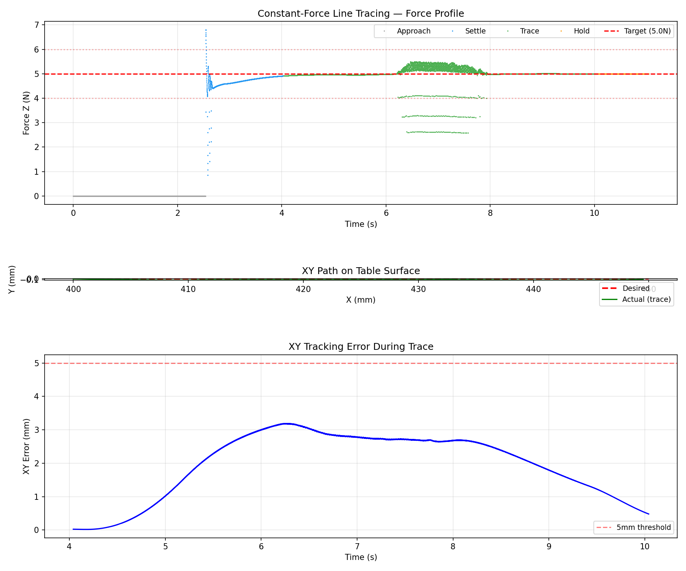

# MuJoCo Robotics Lab

[](https://mujoco.org/)
[](https://github.com/stack-of-tasks/pinocchio)
[](https://www.python.org/)
[](LICENSE)
[](https://github.com/ozkannceylan/mujoco-robotics-lab/stargazers)

An open curriculum for rebuilding robotics fundamentals in **MuJoCo**, with **Pinocchio** as the analytical brain for cross-validation. Each lab is a self-contained progression from forward kinematics through dynamics and control to a final integration demo. Code, models, metrics, and bilingual writeups (English + Turkish) ship together so every result is reproducible.

## Lab Roadmap

| Lab | Topic | Status |
|-----|-------|--------|
| 1   | 2-link planar arm | Complete |
| 2   | UR5e 6-DOF arm | Complete |
| 3   | Dynamics & force control | Complete |
| 4   | Motion planning & collision avoidance | Complete |
| 5   | Grasping & manipulation | Complete\* |
| 6   | Dual-arm coordination | Planned |
| 7   | Locomotion fundamentals | Planned |
| 8   | Whole-body loco-manipulation | Planned |
| 9   | VLA integration | Planned |

Only labs marked **Complete** have published writeups and metrics in this README. Planned labs may have in-progress code on disk but are not yet portfolio-ready.

\* **Lab 5** ships its core pick-and-place pipeline complete and tested; a separate *pro demo hardening* track (record_pro_demo.py + RRT\* integration) is still open and is called out in the Lab 5 README.

---

## Labs

### Lab 1: 2-Link Planar Arm

A minimal 2-DOF planar robot arm. Everything is built from first principles — the math stays visible and every concept maps directly to code.

**Final demo**: Draws a precise **10 cm Cartesian square** with computed torque control.


| Metric | Value |
|---|---|
| Square tracking RMS error | 0.008 mm |
| Max torque | 0.076 Nm |
| IK success rate | 100% |

[Go to Lab 1](lab-1-2link-arm/)

---

### Lab 2: UR5e Industrial Robot Arm

A full 6-DOF industrial manipulator using the **UR5e** model from MuJoCo Menagerie, with **Pinocchio** for analytical computations and **MuJoCo** for physics simulation.

**Final demo**: Draws a **3D cube** (12 edges) with sub-millimeter precision using gravity compensation + velocity feedforward.


| Metric | Value |
|---|---|
| Cube tracking RMS error | 0.088 mm |
| Max torque | 16.50 Nm |
| IK waypoint error | < 0.1 mm |

[Go to Lab 2](lab-2-Ur5e-robotics-lab/)

---

### Lab 3: Dynamics & Force Control

The first lab where the robot actually pushes on something. Lab 3 leaves pure kinematics behind: rigid-body dynamics from Pinocchio (`M`, `C`, `g`) feed gravity compensation, Cartesian impedance, and a hybrid position-force controller running on the **MuJoCo Menagerie UR5e + mounted Robotiq 2F-85** under torque-level control.

**Final demo**: End-effector descends to a table, regulates a **constant 5 N downward force**, and traces a straight line in XY with sub-2 mm position error.



| Metric | Value |
|---|---|
| Pinocchio↔MuJoCo dynamics parity | 8.0e-06 (gravity) / 3.3e-05 (mass matrix) |
| Gravity-comp hold (max joint error) | 8.91e-06 rad |
| Hybrid force-control in-band rate (5 ± 1 N) | 99.96 % |
| Line-trace in-band rate (5 ± 1 N) | 94.07 % |
| Line-trace max XY error | 1.70 mm |
| Tests shipped with the lab | 34 across 4 files |

[Go to Lab 3](lab-3-dynamics-force-control/)

---

### Lab 4: Motion Planning & Collision Avoidance

Lab 4 introduces obstacles. RRT and RRT\* are implemented from scratch in 6-D joint space, with collision truth coming from the *same* MuJoCo geometry that execution uses — planner and controller agree on what "in collision" means. Path shortcutting + time parameterization feed the trajectory into Lab 3's PD + gravity-compensation controller.

**Final demo**: Multi-segment RRT\* path weaves the UR5e end-effector through **4 staggered tabletop obstacles**, then a blocked-path validation scene shortcuts a 35-waypoint plan down to 3 and executes it at 0.0037 rad RMS.


| Metric | Value |
|---|---|
| Standard capstone RMS tracking error | 0.0125 rad |
| Blocked-path scene RMS tracking error | 0.0037 rad |
| Blocked-path raw → shortcut waypoints | 35 → 3 |
| Blocked-path raw → shortcut cost | 9.895 → 7.873 |
| Tests shipped with the lab | 44 passed, 1 skipped |

[Go to Lab 4](lab-4-motion-planning/)

---

### Lab 5: Grasping & Manipulation

Lab 5 is the first lab that picks something up. A custom MJCF parallel-jaw gripper is bolted to the UR5e; an 11-state pick-and-place machine drives the gripper, DLS IK plans 4 grasp configurations, and Lab 3 + Lab 4 handle execution and motion planning under the hood. No new low-level control or planning code — Lab 5 is integration.

**Final demo**: 150 g, 40 mm cube picked from one tabletop location and placed at another with sub-0.1 mm IK accuracy and sub-5 mrad joint tracking.

> Note: the core pick-and-place pipeline is shipped and tested. A pro-demo hardening track (record_pro_demo.py) is still open and is documented in the Lab 5 README.

| Metric | Value |
|---|---|
| IK position accuracy | < 0.1 mm |
| Joint tracking error | < 5 mrad |
| Gripper gap (open / closed) | 60 mm / 0 mm |
| Box mass | 150 g |
| Planning time per segment | 200–600 ms (RRT\*, 6000 iter) |
| Tests shipped with the lab | 33 across 3 files |

[Go to Lab 5](lab-5-grasping-manipulation/)

---

## Repository Structure

```
mujoco-robotics-lab/
├── lab-1-2link-arm/              # Lab 1: 2-Link Planar Arm
│   ├── src/                      #   Source scripts (A1–C1)
│   ├── models/                   #   MuJoCo XML models
│   ├── docs/                     #   English documentation
│   ├── docs-turkish/             #   Turkish documentation
│   ├── media/                    #   Videos and GIFs
│   ├── tests/                    #   Unit tests
│   └── README.md                 #   Lab overview
│
├── lab-2-Ur5e-robotics-lab/      # Lab 2: UR5e 6-DOF Arm
│   ├── src/                      #   Source scripts (A1–C3)
│   ├── models/                   #   URDF, MJCF, Menagerie files
│   ├── docs/                     #   English documentation
│   ├── docs-turkish/             #   Turkish documentation
│   ├── media/                    #   Videos and GIFs
│   ├── tests/                    #   Unit tests
│   └── README.md                 #   Lab overview
│
├── lab-3-dynamics-force-control/ # Lab 3: Dynamics & Force Control
│   ├── src/                      #   A1, A2, B1, B2, C1, C2 + lab3_common
│   ├── models/                   #   UR5e URDF + torque/table MJCF scenes
│   ├── docs/                     #   English documentation
│   ├── docs-turkish/             #   Turkish documentation
│   ├── media/                    #   Plots, validation video
│   ├── tests/                    #   Pytest suite (34 tests)
│   └── README.md                 #   Lab overview
│
├── lab-4-motion-planning/        # Lab 4: Motion Planning & Collision Avoidance
│   ├── src/                      #   Collision / RRT* / smoother / executor / capstone
│   ├── models/                   #   UR5e collision URDF + obstacle MJCF scenes
│   ├── docs/                     #   English documentation
│   ├── docs-turkish/             #   Turkish documentation
│   ├── media/                    #   Plots, slalom demo, validation video
│   ├── tests/                    #   Pytest suite (44 passed, 1 skipped)
│   └── README.md                 #   Lab overview
│
├── lab-5-grasping-manipulation/  # Lab 5: Grasping & Manipulation
│   ├── src/                      #   Gripper / DLS IK / state machine / demo
│   ├── models/                   #   ur5e_gripper.xml + scene_grasp.xml
│   ├── docs/                     #   English documentation
│   ├── docs-turkish/             #   Turkish documentation
│   ├── blog/                     #   Long-form blog post
│   ├── media/                    #   pick_place_demo.mp4, pick_place_pro.mp4
│   ├── tests/                    #   Pytest suite (33 tests)
│   └── README.md                 #   Lab overview
│
├── CLAUDE.md                     # Project instructions for AI assistant
└── README.md                     # This file
```

Each lab is self-contained with its own source code, models, documentation, tests, and media. New labs follow the same structure.

---

## Quick Start

### Install dependencies

```bash
pip install mujoco numpy pinocchio imageio[ffmpeg] matplotlib
```

### Run a lab demo

```bash
# Lab 1: 2-link square drawing
python3 lab-1-2link-arm/src/c1_draw_square.py

# Lab 2: UR5e cube drawing
python3 lab-2-Ur5e-robotics-lab/src/c3_draw_cube.py

# Lab 3: constant-force line trace on a table
python3 lab-3-dynamics-force-control/src/c2_line_trace.py

# Lab 4: RRT* slalom through 4 tabletop obstacles
python3 lab-4-motion-planning/src/capstone_demo.py

# Lab 5: pick-and-place capstone
python3 lab-5-grasping-manipulation/src/pick_place_demo.py
```

---

## Topics Covered

The published labs cover the same fundamental topics at increasing scale and physical realism:

| Topic | Lab 1 (2-DOF) | Lab 2 (6-DOF) | Lab 3 (Force Control) |
|---|---|---|---|
| Forward Kinematics | Analytic 2-link FK | DH + Pinocchio + MuJoCo cross-validation | Reused from Lab 2 |
| Jacobian | 2x2 analytic | Geometric, Pinocchio, numerical + singularity analysis | Pinocchio Jacobians for `τ = Jᵀ·F` |
| Inverse Kinematics | Analytic + pseudo-inverse + DLS | Pseudo-inverse + adaptive DLS | DLS into contact-aware targets |
| Dynamics | M, C, g from MuJoCo | Pinocchio RNEA, ABA, CRBA + cross-validation | RNEA/CRBA parity at sub-1e-4 |
| Trajectory | Cubic, quintic | Cubic, quintic, trapezoidal, min-jerk, multi-segment | Straight-line task-space path under contact |
| Control | PD + gravity compensation | PD+g, computed torque, task-space impedance, OSC | Gravity comp + Cartesian impedance + hybrid force |
| Contact | — | — | `mj_contactForce` over full EE contact set, 5 ± 1 N regulation |
| Integration | Square drawing | Pick-and-place pipeline + 3D cube drawing | Constant-force line trace on a table |

---

## Core Architecture (Lab 2)

```
Pinocchio = analytical brain (FK, Jacobian, M, C, g, IK)
MuJoCo   = physics simulator (step, render, contact, sensor)
```

Both engines are cross-validated against each other at every stage to ensure correctness.

---

## Documentation

Each lab has full English and Turkish documentation in its `docs/` and `docs-turkish/` folders. See the individual lab READMEs for links.

---

## Open Source

The original code, documentation, and writeups in this repository are released
under the Apache License 2.0. See [LICENSE](LICENSE).

This repository also includes third-party robot models and description assets
that keep their own upstream licenses. See [THIRD_PARTY_NOTICES.md](THIRD_PARTY_NOTICES.md)
for the exact paths and license scope.

Important: a subset of bundled Universal Robots mesh directories in
`lab-2-Ur5e-robotics-lab/models/Universal_Robots_ROS2_Description/meshes/`
is redistributable under vendor terms but is not fully OSI-open-source. The
project's root license does not override those files.

## Contributing

See [CONTRIBUTING.md](CONTRIBUTING.md) for development expectations,
[CODE_OF_CONDUCT.md](CODE_OF_CONDUCT.md) for community standards, and
[SECURITY.md](SECURITY.md) for responsible disclosure guidance.
