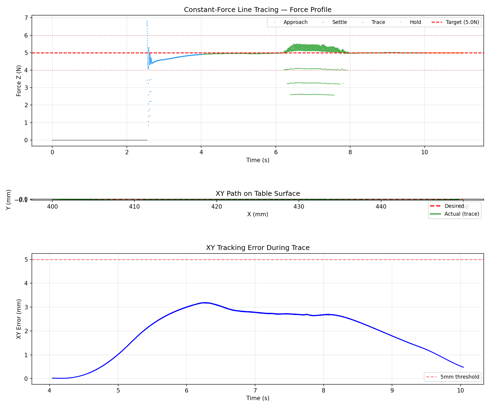
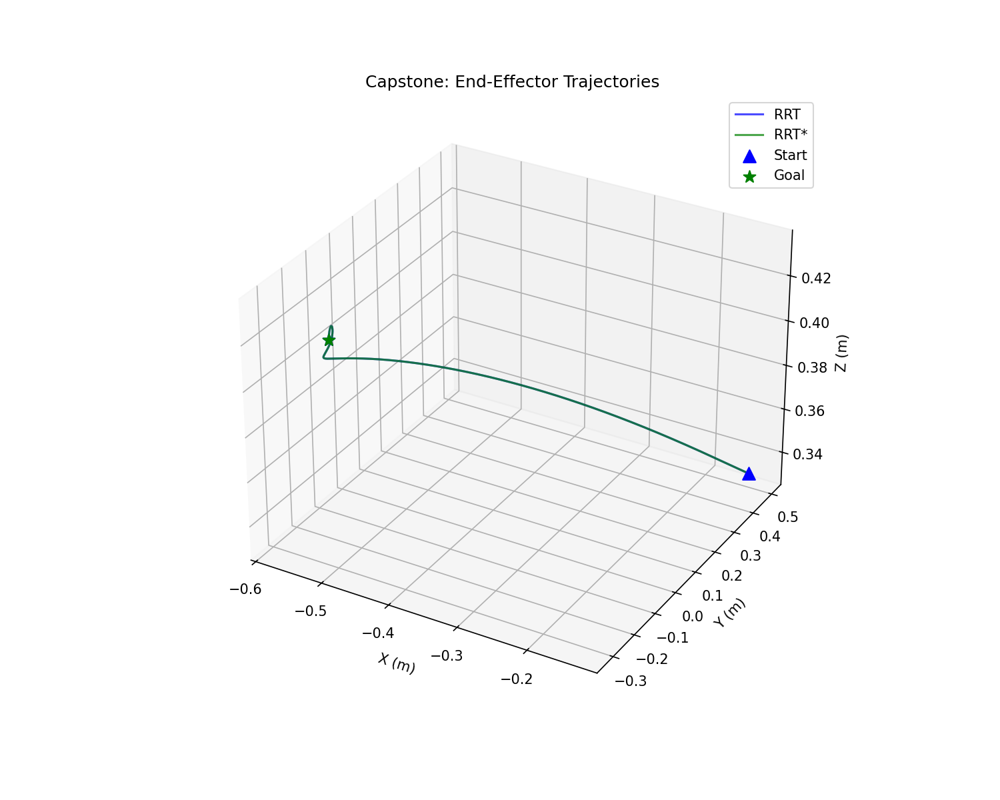
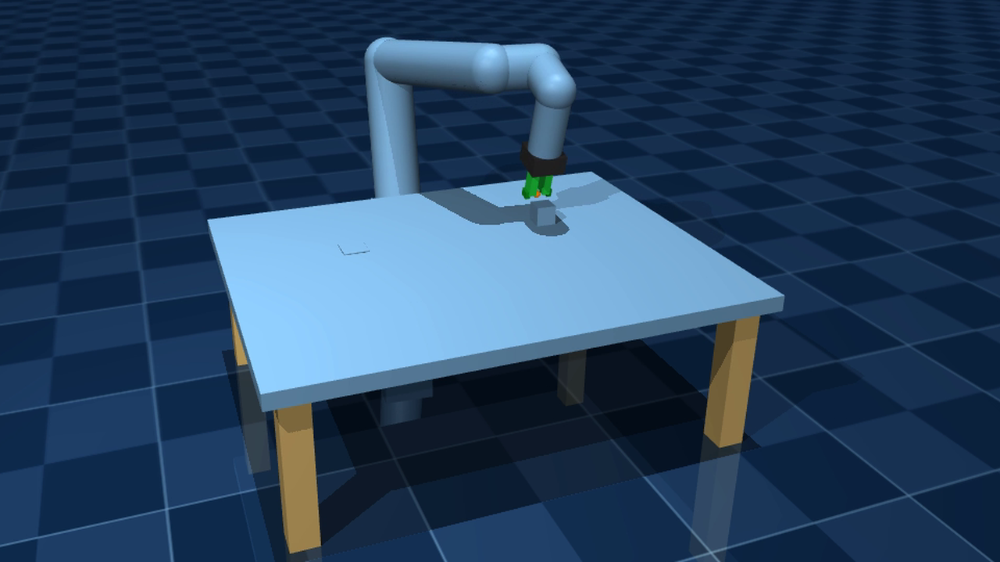
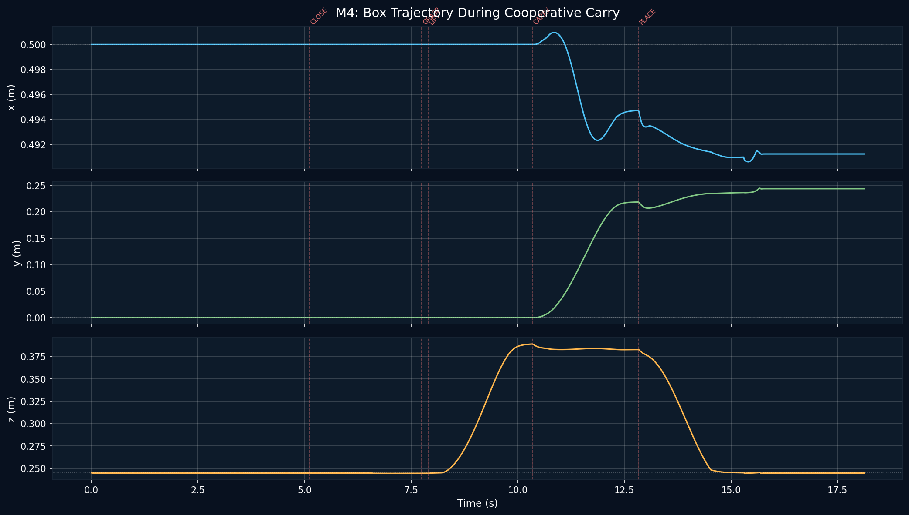
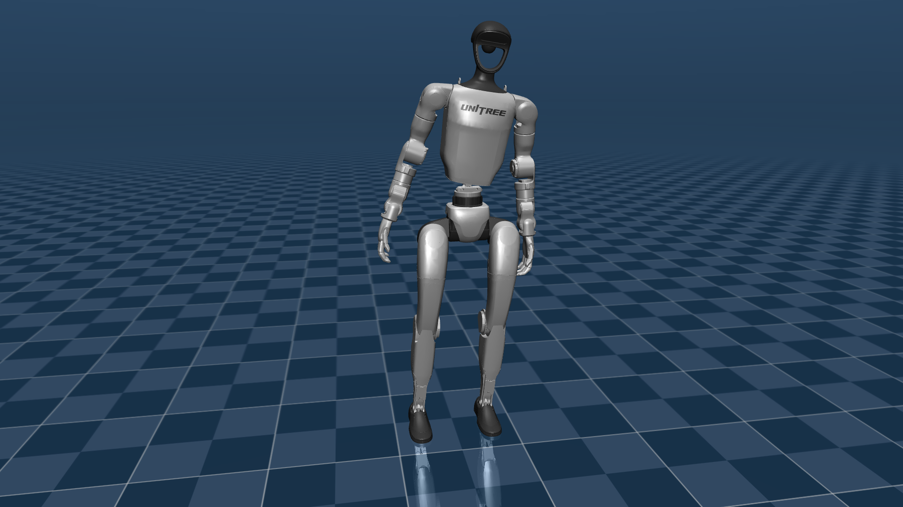
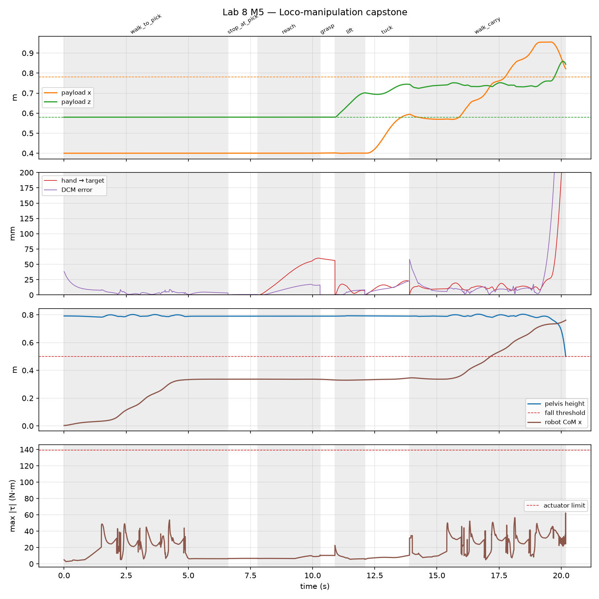

# MuJoCo Robotics Lab

[](https://mujoco.org/)
[](https://github.com/stack-of-tasks/pinocchio)
[](https://www.python.org/)
[](LICENSE)
[](https://github.com/ozkannceylan/mujoco-robotics-lab/stargazers)

An open curriculum for rebuilding robotics fundamentals in **MuJoCo**, with **Pinocchio** as the analytical brain for cross-validation. Each lab is a self-contained progression from forward kinematics through dynamics and control to a final integration demo. Code, models, metrics, and bilingual writeups (English + Turkish) ship together so every result is reproducible.

## Lab Roadmap

| Lab | Topic | Status |
|-----|-------|--------|
| 1   | 2-link planar arm | Complete |
| 2   | UR5e 6-DOF arm | Complete |
| 3   | Dynamics & force control | Complete |
| 4   | Motion planning & collision avoidance | Complete |
| 5   | Grasping & manipulation | Complete\* |
| 6   | Dual-arm coordination | Complete |
| 7   | Locomotion fundamentals | Complete\*\* |
| 8   | Whole-body loco-manipulation | Complete\*\*\* |
| 9   | VLA integration | Planned |

Only labs marked **Complete** have published writeups and metrics in this README. Planned labs may have in-progress code on disk but are not yet portfolio-ready.

\* **Lab 5** fully closed 2026-08-13: the pro-demo hardening track shipped (SO(3)-log IK, RRT\* integration, per-step self-collision monitor — 0 collisions), and the capstone box-transport defect (Step 6.1) was root-caused to an outside-mounted friction pad in the gripper model plus five controller/planning issues — all fixed. The capstone now places the box **5.7 mm** from target (30 mm tolerance) with a post-condition assert so a missed transport can never again read as success.

\*\* **Lab 7** is signed off at M3d scope: static balance, push recovery, FK/IK validation, and quasi-static weight shifting all pass their gates. Dynamic ZMP walking (M4) was identified as structurally infeasible with the Menagerie G1's position actuators — the lab's M5 documentation and blog post explain the diagnostic work in full rather than papering over the limit.

\*\*\* **Lab 8** takes up exactly where Lab 7 stopped, and tests its diagnosis. **M0 (2026-08-15)** re-actuates the G1 with torque motors instead of position servos and re-establishes a 10 s stand from outside the simulator. **M1** adds the whole-body inverse-dynamics QP — joint accelerations *and* contact wrenches as decision variables — so the standing robot tracks a hand circle to 7.08 mm RMS while balance stays a hard constraint. **M2** takes four torque-level steps in place. **M3 (2026-08-16) walks: 12 steps, 1.18 m, no fall** — the capstone Lab 7 abandoned, on the same robot, which settles the actuator-model question. It got there by replacing the CoM position reference with **divergent-component-of-motion tracking**, and then by fixing two things underneath the controller that mattered more than the controller did: the foot's centre-of-pressure model was a symmetric guess rather than the G1's real asymmetric sole, and the QP's solver tolerance was set below what the problem's conditioning can deliver. **M4 walks and works at the same time**: the same 12 steps while both hands hold a Cartesian carry pose to 14.5 mm RMS. The enabler was a *missing term*, not a weight — no hand-task weight both walked and tracked, and the failures were non-monotonic, which is the tell. Regulating **centroidal angular momentum** took the identical hand task from falling on step 7 to the full distance with three times better tracking. **M5 (2026-08-17) is the capstone**: one continuous 25-second episode in which the robot walks to a pedestal, picks up a payload, brings it to its chest and secures it with the second hand, carries it, and sets it down **11.8 mm** from the target without falling. Its ten defects are the lab's most useful result — three were in code M0–M4 had already exercised, two were scene geometry the balance controller cannot see (a pedestal at hip height felled a controller that walks 12 steps on bare ground), and two were the difference between commanding a hand and commanding the object held in it. **M6 (2026-08-17)** closes the lab with architecture docs (EN/TR), a code walkthrough and the blog post. 97 tests. See [`lab-8-loco-manipulation/`](lab-8-loco-manipulation/).

---

## Labs

### Lab 1: 2-Link Planar Arm

A minimal 2-DOF planar robot arm. Everything is built from first principles — the math stays visible and every concept maps directly to code.

**Final demo**: Draws a precise **10 cm Cartesian square** with computed torque control.


| Metric | Value |
|---|---|
| Square tracking RMS error | 0.008 mm |
| Max torque | 0.076 Nm |
| IK success rate | 100% |

[Go to Lab 1](lab-1-2link-arm/)

---

### Lab 2: UR5e Industrial Robot Arm

A full 6-DOF industrial manipulator using the **UR5e** model from MuJoCo Menagerie, with **Pinocchio** for analytical computations and **MuJoCo** for physics simulation.

**Final demo**: Draws a **3D cube** (12 edges) with sub-millimeter precision using gravity compensation + velocity feedforward.


| Metric | Value |
|---|---|
| Cube tracking RMS error | 0.088 mm |
| Max torque | 16.50 Nm |
| IK waypoint error | < 0.1 mm |

[Go to Lab 2](lab-2-Ur5e-robotics-lab/)

---

### Lab 3: Dynamics & Force Control

The first lab where the robot actually pushes on something. Lab 3 leaves pure kinematics behind: rigid-body dynamics from Pinocchio (`M`, `C`, `g`) feed gravity compensation, Cartesian impedance, and a hybrid position-force controller running on the **MuJoCo Menagerie UR5e + mounted Robotiq 2F-85** under torque-level control.

**Final demo**: End-effector descends to a table, regulates a **constant 5 N downward force**, and traces a straight line in XY with sub-2 mm position error.



| Metric | Value |
|---|---|
| Pinocchio↔MuJoCo dynamics parity | 8.0e-06 (gravity) / 3.3e-05 (mass matrix) |
| Gravity-comp hold (max joint error) | 8.91e-06 rad |
| Hybrid force-control in-band rate (5 ± 1 N) | 99.96 % |
| Line-trace in-band rate (5 ± 1 N) | 94.07 % |
| Line-trace max XY error | 1.70 mm |
| Tests shipped with the lab | 34 across 4 files |

[Go to Lab 3](lab-3-dynamics-force-control/)

---

### Lab 4: Motion Planning & Collision Avoidance

Lab 4 introduces obstacles. RRT and RRT\* are implemented from scratch in 6-D joint space, with collision truth coming from the *same* MuJoCo geometry that execution uses — planner and controller agree on what "in collision" means. Path shortcutting + time parameterization feed the trajectory into Lab 3's PD + gravity-compensation controller.

**Final demo**: Multi-segment RRT\* path weaves the UR5e end-effector through **4 staggered tabletop obstacles**, then a blocked-path validation scene shortcuts a 35-waypoint plan down to 3 and executes it at 0.0037 rad RMS.



| Metric | Value |
|---|---|
| Standard capstone RMS tracking error | 0.0125 rad |
| Blocked-path scene RMS tracking error | 0.0037 rad |
| Blocked-path raw → shortcut waypoints | 35 → 3 |
| Blocked-path raw → shortcut cost | 9.895 → 7.873 |
| Tests shipped with the lab | 44 passed, 1 skipped |

[Go to Lab 4](lab-4-motion-planning/)

---

### Lab 5: Grasping & Manipulation

Lab 5 is the first lab that picks something up. A custom MJCF parallel-jaw gripper is bolted to the UR5e; an 11-state pick-and-place machine drives the gripper, DLS IK plans 4 grasp configurations, and Lab 3 + Lab 4 handle execution and motion planning under the hood. No new low-level control or planning code — Lab 5 is integration.

**Final demo**: 150 g, 40 mm cube picked from one tabletop location and placed at another with sub-0.1 mm IK accuracy and sub-5 mrad joint tracking.



> Note: the pro demo (record_pro_demo.py) plans all long transfers with Lab 4's RRT\* and verifies zero self-collision across every simulation step of the recording. The capstone demo carries a transport post-condition: the run fails unless the box lands within 30 mm of the place target (achieved: 5.7 mm).

| Metric | Value |
|---|---|
| IK position accuracy | < 0.1 mm |
| Joint tracking error | < 5 mrad |
| Gripper gap (open / closed) | 60 mm / 0 mm |
| Box mass | 150 g |
| Planning time per segment | 200–600 ms (RRT\*, 6000 iter) |
| Tests shipped with the lab | 33 across 3 files |

[Go to Lab 5](lab-5-grasping-manipulation/)

---

### Lab 6: Dual-Arm Coordination

Two UR5e arms 1 m apart grasp a 30×15×15 cm box from opposite sides, lift it, carry it laterally, and place it back on the table. Verification is **milestone-based** — each of M0–M5 ends with explicit numerical gate criteria and a recorded artifact rather than a unit-test suite.

**Final demo**: 6-state cooperative carry pipeline (APPROACH → CLOSE → GRASP → LIFT → CARRY → PLACE) with arrival synchronization within 2 ms between arms and weld-constraint grasping.



| Metric | Value |
|---|---|
| FK Pinocchio↔MuJoCo round-trip | 0.000 mm |
| IK convergence | 20/20 (6-DOF) + 5/5 (pos-only) |
| Per-arm Cartesian error (approach) | 0.10 mm (L) / 0.09 mm (R) |
| Arrival synchronization between arms | 2.0 ms |
| Lift / carry distance | 15 cm / 22 cm |
| Place dz / rotation error | 0.0 cm / 4° |

[Go to Lab 6](lab-6-dual-arm/)

---

### Lab 7: Locomotion Fundamentals

Lab 7 moves from manipulators to a humanoid: the **Unitree G1** (29 DOF, 33.34 kg) in MuJoCo with Pinocchio for floating-base kinematics. Lab 7 takes the standing / IK / quasi-static balance stack as far as the Menagerie G1's position actuators allow, then **honestly documents the structural limit** that prevents classical ZMP walking from working with position-PD control — rather than papering over it.

**Final demo**: standing under 5 N push, 5 cm lateral weight shift with stacked-Jacobian whole-body IK pinning the feet (foot drift < 1.4 mm), plus a LIPM/ZMP plot overlay.



| Metric | Value |
|---|---|
| Pelvis deviation under 5 N push | 1.6 mm |
| CoM Pinocchio↔MuJoCo cross-validation | 0.000 mm |
| Jacobian column validation (12 leg joints) | 0/36 failures |
| Whole-body IK foot slip on 5 cm CoM shift | 0.51 mm |
| Quasi-static weight shift / drift | 53.5 mm / 1.36 mm |
| Dynamic ZMP walking | structurally blocked (position actuators) |

[Go to Lab 7](lab-7-locomotion/)

---

### Lab 8: Whole-Body Loco-Manipulation

Lab 8 takes the same Unitree G1, replaces its position servos with **torque motors**, and rebuilds the stack around a whole-body **inverse-dynamics QP** — joint accelerations *and* contact wrenches as decision variables, solved once per millisecond. That settles the question Lab 7 left open: the robot walks. Balance is commanded through the **divergent component of motion** (`ξ = c + ċ/ω`) rather than a CoM position reference, and arm tasks are made compatible with walking by regulating **centroidal angular momentum** rather than by re-weighting.

**Final demo**: one continuous 25-second episode — walk to a pedestal, stop, reach, grasp, lift, secure the load two-handed at the chest, walk carrying it, stop, place, release.



| Metric | Value |
|---|---|
| Model parity vs MuJoCo (`M`, `g`) | 9.3e-17 / 1.7e-16 relative |
| Standing hand-circle tracking (M1) | 7.08 mm RMS |
| Forward walking (M3) | 12 / 12 steps, **1.18 m**, DCM RMS 6.2 mm |
| ZMP inside support polygon while walking | 99.3 % of loaded ticks |
| Walk + two-handed carry (M4) | 12 / 12 steps, hand 14.5 mm RMS |
| Capstone payload placement (M5) | **11.8 mm** from target, transported 0.384 m |
| QP solve time | 0.073 ms mean (47–53 variables) |
| Peak torque / limit | 56.0 / 139 N·m |

[Go to Lab 8](lab-8-loco-manipulation/) · [Blog post](lab-8-loco-manipulation/blog/lab8_loco_manipulation.md)

---

## Repository Structure

```
mujoco-robotics-lab/
├── lab-1-2link-arm/              # Lab 1: 2-Link Planar Arm
│   ├── src/                      #   Source scripts (A1–C1)
│   ├── models/                   #   MuJoCo XML models
│   ├── docs/                     #   English documentation
│   ├── docs-turkish/             #   Turkish documentation
│   ├── blog/                     #   Long-form blog post
│   ├── media/                    #   Videos and GIFs
│   ├── ros2_bridge/              #   ROS 2 bridge node
│   ├── tests/                    #   Pytest suite (26 tests)
│   └── README.md                 #   Lab overview
│
├── lab-2-Ur5e-robotics-lab/      # Lab 2: UR5e 6-DOF Arm
│   ├── src/                      #   Source scripts (A1–C3)
│   ├── models/                   #   URDF + MJCF (Menagerie clone lands here — see Setup)
│   ├── docs/                     #   English documentation
│   ├── docs-turkish/             #   Turkish documentation
│   ├── blog/                     #   Long-form blog post
│   ├── media/                    #   Videos and GIFs
│   ├── tests/                    #   Unit tests
│   └── README.md                 #   Lab overview
│
├── lab-3-dynamics-force-control/ # Lab 3: Dynamics & Force Control
│   ├── src/                      #   A1, A2, B1, B2, C1, C2 + lab3_common
│   ├── models/                   #   UR5e URDF + torque/table MJCF scenes
│   ├── docs/                     #   English documentation
│   ├── docs-turkish/             #   Turkish documentation
│   ├── media/                    #   Plots, validation video
│   ├── tests/                    #   Pytest suite (34 tests)
│   └── README.md                 #   Lab overview
│
├── lab-4-motion-planning/        # Lab 4: Motion Planning & Collision Avoidance
│   ├── src/                      #   Collision / RRT* / smoother / executor / capstone
│   ├── models/                   #   UR5e collision URDF + obstacle MJCF scenes
│   ├── docs/                     #   English documentation
│   ├── docs-turkish/             #   Turkish documentation
│   ├── media/                    #   Plots, slalom demo, validation video
│   ├── tests/                    #   Pytest suite (44 passed, 1 skipped)
│   └── README.md                 #   Lab overview
│
├── lab-5-grasping-manipulation/  # Lab 5: Grasping & Manipulation
│   ├── src/                      #   Gripper / DLS IK / state machine / demo
│   ├── models/                   #   ur5e_gripper.xml + scene_grasp.xml
│   ├── docs/                     #   English documentation
│   ├── docs-turkish/             #   Turkish documentation
│   ├── blog/                     #   Long-form blog post
│   ├── media/                    #   pick_place_demo.mp4, pick_place_pro.mp4
│   ├── tests/                    #   Pytest suite (33 tests)
│   └── README.md                 #   Lab overview
│
├── lab-6-dual-arm/               # Lab 6: Dual-Arm Coordination
│   ├── src/                      #   Milestones M0-M5 + dual-arm kinematics
│   ├── models/                   #   scene_dual.xml + per-arm MJCF + URDF
│   ├── docs/                     #   ARCHITECTURE.md + CODE_WALKTHROUGH.md
│   ├── docs-turkish/             #   ARCHITECTURE_TR.md
│   ├── blog/                     #   Long-form blog post
│   ├── media/                    #   Per-milestone videos + trajectory plots
│   └── README.md                 #   Lab overview
│
├── lab-7-locomotion/             # Lab 7: Locomotion Fundamentals (G1 humanoid)
│   ├── src/                      #   Milestones M0-M5 + standing / whole-body IK / LIPM
│   ├── models/                   #   Lab-side overlays (G1 model from upstream Menagerie)
│   ├── docs/                     #   ARCHITECTURE.md + CODE_WALKTHROUGH.md + joint map
│   ├── docs-turkish/             #   ARCHITECTURE_TR.md
│   ├── blog/                     #   "Why Making a Humanoid Walk is Harder Than It Looks"
│   ├── media/                    #   Per-milestone videos + plots + validation .txt
│   └── README.md                 #   Lab overview
│
├── lab-8-loco-manipulation/      # Lab 8: Whole-Body Loco-Manipulation (torque G1)
│   ├── src/                      #   Milestones M0-M5 + ID QP / tasks / gait + DCM planners
│   ├── models/                   #   Torque model generated at runtime from Menagerie
│   ├── docs/                     #   ARCHITECTURE.md + CODE_WALKTHROUGH.md
│   ├── docs-turkish/             #   ARCHITECTURE_TR.md
│   ├── blog/                     #   "The Humanoid Walked Once I Stopped Telling It Where to Stand"
│   ├── tests/                    #   97 tests (parity, FD Jacobians, QP constraints, DCM)
│   ├── media/                    #   Per-milestone videos + metric plots
│   └── README.md                 #   Lab overview
│
├── plan/                         # Lab briefs (LAB_01–LAB_09) + MASTER_PLAN.md
├── tasks/                        # Cross-lab todo / lessons / project reviews
├── tools/                        # setup_env.sh + video_producer.py
├── third_party/                  # Upstream assets (gitignored — created by setup_env.sh)
├── attic/                        # Archived / superseded writeups
│
├── CLAUDE.md                     # Project instructions for AI assistant
└── README.md                     # This file
```

Each lab is self-contained with its own source code, models, documentation, and
media. Test coverage varies by lab: labs 1–5, 7 and 8 ship pytest suites, while lab 6
is verified through numerical milestone gates (M0–M5) rather than unit tests.
New labs follow the same structure.

---

## Quick Start

### Setup

A bare `git clone` is not enough to run the labs — the MuJoCo Menagerie robot
models are not vendored into this repository. One script handles everything:

```bash
./tools/setup_env.sh
export MUJOCO_GL=egl   # required for headless rendering (machines with no display)
```

`tools/setup_env.sh` installs the Python dependencies, sparse-clones the
Menagerie models (UR5e, Robotiq 2F-85, Unitree G1) into the two locations the
labs expect, and installs the EGL runtime for offscreen rendering. It is
idempotent, so re-running it is safe.

### Install dependencies

If you prefer to install by hand instead of running the setup script:

```bash
pip install mujoco numpy pin scipy "imageio[ffmpeg]" matplotlib pytest meshcat
```

> Pinocchio ships on PyPI as **`pin`** (it provides `import pinocchio`). The
> package literally named `pinocchio` is an unrelated project — don't install it.

### Run a lab demo

```bash
# Lab 1: 2-link square drawing
python3 lab-1-2link-arm/src/c1_draw_square.py

# Lab 2: UR5e cube drawing
python3 lab-2-Ur5e-robotics-lab/src/c3_draw_cube.py

# Lab 3: constant-force line trace on a table
python3 lab-3-dynamics-force-control/src/c2_line_trace.py

# Lab 4: RRT* slalom through 4 tabletop obstacles
python3 lab-4-motion-planning/src/capstone_demo.py

# Lab 5: pick-and-place capstone
python3 lab-5-grasping-manipulation/src/pick_place_demo.py

# Lab 6: dual-arm cooperative carry capstone
python3 lab-6-dual-arm/src/m5_capstone_demo.py

# Lab 7: G1 standing + 5 cm weight shift + LIPM/ZMP overlay
python3 lab-7-locomotion/src/m5_capstone_demo.py

# Lab 8: torque-controlled G1 walks → picks → carries → places (needs MUJOCO_GL=egl)
MUJOCO_GL=egl python3 lab-8-loco-manipulation/src/m5_capstone.py
```

---

## Topics Covered

The published labs cover the same fundamental topics at increasing scale and physical realism:

| Topic | Lab 1 (2-DOF) | Lab 2 (6-DOF) | Lab 3 (Force Control) | Lab 4 (Motion Planning) | Lab 5 (Grasping) | Lab 6 (Dual-Arm) | Lab 7 (Locomotion) | Lab 8 (Loco-Manipulation) |
|---|---|---|---|---|---|---|---|---|
| Forward Kinematics | Analytic 2-link FK | DH + Pinocchio + MuJoCo cross-validation | Reused from Lab 2 | Reused — FK drives Cartesian via-points | Pinocchio FK on UR5e + custom gripper frame | `DualArmModel` FK, 0.000 mm round-trip vs MuJoCo | Floating-base FK on the G1 (`nq ≠ nv`, quaternion) | Floating-base FK reused from Lab 7, evaluated once per control tick |
| Jacobian | 2x2 analytic | Geometric, Pinocchio, numerical + singularity analysis | Pinocchio Jacobians for `τ = Jᵀ·F` | Used by seeded IK at each via-point | Frame Jacobian feeding DLS grasp IK | Per-arm Pinocchio Jacobians in `DualArmModel` | `LOCAL_WORLD_ALIGNED`, finite-difference validated (0/36 failures) | Frame + CoM + centroidal momentum map `A_g`, all FD-validated |
| Inverse Kinematics | Analytic + pseudo-inverse + DLS | Pseudo-inverse + adaptive DLS | DLS into contact-aware targets | Seeded DLS keeps the elbow on one side across segments | DLS with `pin.log3` SO(3) orientation error, 4 seeded grasp poses | Dual-arm DLS, 300 restarts + collision-checked candidates | Stacked-Jacobian whole-body DLS, 18 task rows | None — control is at the acceleration level, no IK on the path |
| Dynamics | M, C, g from MuJoCo | Pinocchio RNEA, ABA, CRBA + cross-validation | RNEA/CRBA parity at sub-1e-4 | Gravity compensation reused from Lab 3 | Gravity compensation inside Lab 3's impedance torque | Per-arm gravity compensation | CoM dynamics + LIPM (Kajita preview control) | Full ID: `M q̈ + h = Sᵀτ + J_cᵀ f`, parity to 1e-16 vs MuJoCo |
| Trajectory | Cubic, quintic | Cubic, quintic, trapezoidal, min-jerk, multi-segment | Straight-line task-space path under contact | RRT/RRT\* path → shortcutting → TOPP-RA (quintic fallback) | Lab 4 plan + smoothing per pick-and-place segment | 2 s smooth-step bimanual interpolation, arms synced to 2 ms | Footstep plan + ZMP reference + cubic/parabolic swing foot | Footstep plan → piecewise-linear ZMP → back-integrated DCM + swing arcs |
| Control | PD + gravity compensation | PD+g, computed torque, task-space impedance, OSC | Gravity comp + Cartesian impedance + hybrid force | Lab 3 joint PD + gravity comp (no new control code) | Lab 3 `compute_impedance_torque` under gravity comp | Joint PD + gravity comp (no Cartesian impedance, by design) | Position-PD with gravity feedforward (ankle torque unavailable) | Whole-body inverse-dynamics QP (OSQP), torque motors at 1 kHz |
| Contact | — | — | `mj_contactForce` over full EE contact set, 5 ± 1 N regulation | Collision as a planning constraint (HPP-FCL + MuJoCo geometry), 0.034 m clearance | Gripper-pad contact detection confirms the grasp | Weld-constraint grasp + MuJoCo contact check during IK search | Foot-ground contact; feet pinned to < 1.4 mm drift | Contact wrenches are QP variables: friction pyramid, CoP box, unilateral |
| Integration | Square drawing | Pick-and-place pipeline + 3D cube drawing | Constant-force line trace on a table | RRT\* slalom through 4 tabletop obstacles | 11-state pick-and-place chaining Labs 3 + 4 | 6-state cooperative carry (APPROACH → PLACE) | Standing + 5 cm weight shift + LIPM/ZMP overlay | Walk → pick → two-handed carry → place, payload 11.8 mm from target |

---

## Core Architecture (Lab 2)

```
Pinocchio = analytical brain (FK, Jacobian, M, C, g, IK)
MuJoCo   = physics simulator (step, render, contact, sensor)
```

Both engines are cross-validated against each other at every stage to ensure correctness.

---

## Documentation

Each lab has full English and Turkish documentation in its `docs/` and `docs-turkish/` folders. See the individual lab READMEs for links.

---

## Open Source

The original code, documentation, and writeups in this repository are released
under the Apache License 2.0. See [LICENSE](LICENSE).

This repository also includes third-party robot models and description assets
that keep their own upstream licenses. See [THIRD_PARTY_NOTICES.md](THIRD_PARTY_NOTICES.md)
for the exact paths and license scope.

Important: third-party robot models (MuJoCo Menagerie, Universal Robots
description assets) are **not committed to this repository** — they are cloned
into gitignored paths by `tools/setup_env.sh`. Those upstream assets keep their
own licenses (some Universal Robots meshes are redistributable under vendor
terms but not fully OSI-open-source); the project's root license does not
override them.

## Contributing

See [CONTRIBUTING.md](CONTRIBUTING.md) for development expectations,
[CODE_OF_CONDUCT.md](CODE_OF_CONDUCT.md) for community standards, and
[SECURITY.md](SECURITY.md) for responsible disclosure guidance.
