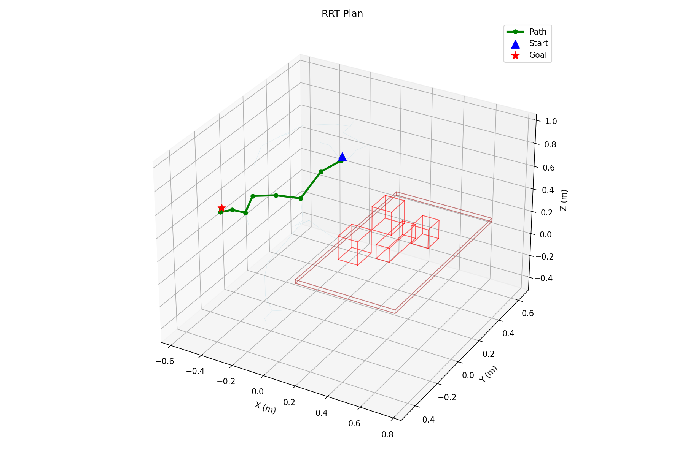
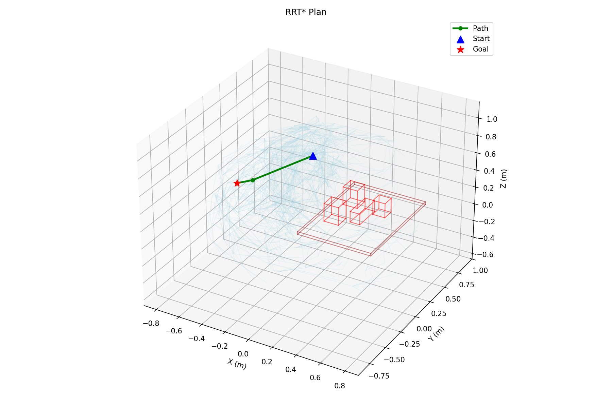
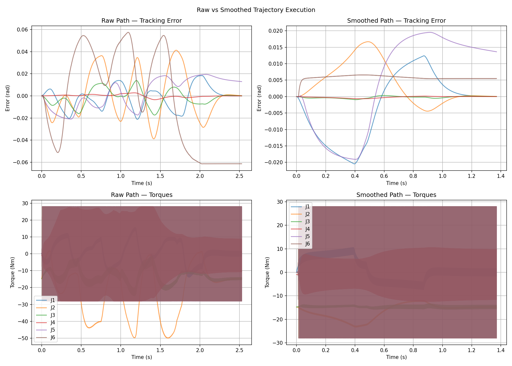
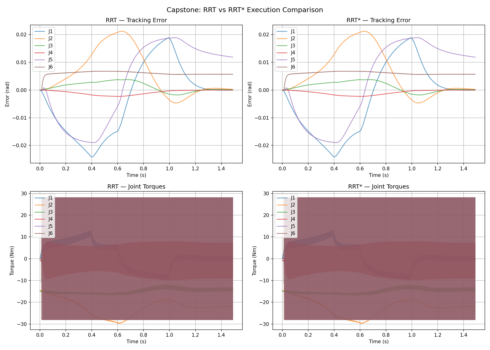
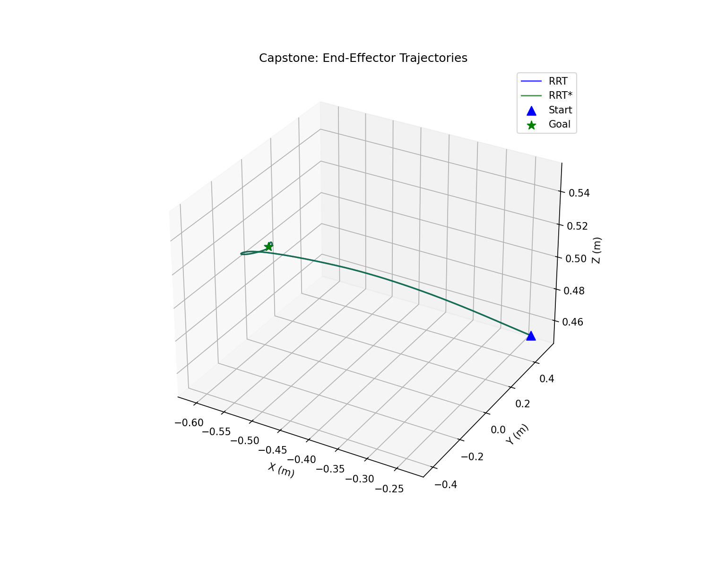

# Lab 4: Motion Planning — Finding Collision-Free Paths in Configuration Space

## Why Motion Planning Matters

Labs 1 through 3 assumed the path between the robot's current configuration and the goal was obstacle-free. We computed a desired joint trajectory and executed it. But real environments have tables, walls, objects, and the robot's own links to avoid. Blindly interpolating from start to goal will drive the arm straight through whatever is in the way.

Motion planning solves a different problem than inverse kinematics. IK answers "what joint angles reach this pose?" Planning answers "how do I get from configuration A to configuration B without hitting anything?" The answer is a sequence of waypoints through the robot's six-dimensional configuration space, each verified to be collision-free.

This is the foundation for everything that follows. Grasping (Lab 5) requires reaching into cluttered scenes. Dual-arm coordination (Lab 6) requires two arms planning around each other. You cannot build any of it without a reliable planner.

## Collision Infrastructure: Pinocchio + HPP-FCL

Before planning a single path, we need a fast, reliable function: given a configuration q, is the robot colliding with anything?

### Building the Collision World

Pinocchio delegates collision detection to HPP-FCL. The setup has two parts: self-collision between the robot's own links, and environment collision against obstacles in the scene.

For self-collision, Pinocchio's URDF loader automatically creates collision geometries for each link. The subtlety is filtering: adjacent links share a joint and their collision geometries overlap by construction. Checking them produces false positives. We skip all pairs where the parent joint indices differ by one or less. This is the adjacency gap filter, and it eliminates the noise without missing real self-collisions.

For environment collision, we add obstacle geometries manually. Each obstacle is an HPP-FCL shape (box, sphere, or cylinder) wrapped in a Pinocchio `GeometryObject` and attached to the universe frame (joint 0). Then we register collision pairs between every robot geometry and every obstacle geometry.

```python
# Add a table as a box obstacle
table_shape = hppfcl.Box(0.60, 0.80, 0.05)
table_geom = pin.GeometryObject(
    "table", 0, 0, table_placement, table_shape
)
collision_model.addGeometryObject(table_geom)
```

A single collision check calls `pin.computeCollisions()`, which runs GJK/EPA across all registered pairs. For a typical scene with the UR5e and a table obstacle, this takes under a millisecond — fast enough that we can call it thousands of times during planning.

### Cross-Validation Against MuJoCo

Pinocchio and MuJoCo use different collision engines with different geometry representations. We validated agreement by sampling 500 random configurations and checking both:

- **92.8% agreement** across all samples
- Disagreements occurred at grazing contacts where one engine reports collision and the other does not, typically within 1-2mm of the collision boundary

This level of agreement is sufficient for planning. The planner uses Pinocchio for speed (no simulation step required), and MuJoCo serves as the ground truth during execution.



## Sampling-Based Planning: RRT and RRT*

The configuration space of a 6-DOF arm is six-dimensional. Grid-based search is hopeless — the number of cells grows exponentially with dimension. Sampling-based planners sidestep this by building a tree of collision-free configurations incrementally.

### RRT: Rapidly-Exploring Random Trees

The core RRT algorithm is elegant in its simplicity:

1. Sample a random configuration q_rand in joint space
2. Find the nearest node q_near in the existing tree
3. Extend from q_near toward q_rand by a fixed step size, producing q_new
4. If the edge from q_near to q_new is collision-free, add q_new to the tree
5. If q_new is close enough to the goal, connect and return the path

The key parameter is **goal bias**: with some probability (we use 10%), we replace q_rand with q_goal. This biases the tree toward the goal without sacrificing the exploration that lets RRT navigate around obstacles. Too much bias and the tree gets stuck pushing into obstacles near the goal. Too little and it wanders.

Edge collision checking is done by interpolating between q_near and q_new at a resolution fine enough that no intermediate configuration is missed. We check at intervals of 2 degrees per joint, which balances safety against computation cost.

### RRT*: Asymptotic Optimality

Standard RRT finds *a* path, but not necessarily a good one. The path often zigzags through configuration space because each node connects to its nearest neighbor regardless of total cost.

RRT* adds two operations:

**Near-neighbor search**: Instead of connecting q_new only to its nearest neighbor, consider all nodes within a radius that shrinks as the tree grows. Connect q_new to whichever neighbor yields the lowest cost-to-come.

**Rewiring**: After adding q_new, check if any nearby nodes would have a shorter path through q_new. If so, rewire their parent.

These two additions guarantee that the path cost converges to the optimum as the number of samples grows. In practice, even a few hundred extra samples produce noticeably shorter paths.



The difference is visible in the tree structure. RRT produces a sprawling tree with long, indirect paths. RRT* produces a more organized tree where paths are progressively straightened as rewiring occurs.

## Trajectory Processing: From Waypoints to Smooth Motion

The raw output of RRT is a sequence of waypoints — collision-free configurations connected by straight-line segments in joint space. This is not yet a trajectory. It has no timing, no velocity profile, and typically far more waypoints than necessary.

### Path Shortcutting

The first optimization is geometric: remove unnecessary waypoints. The algorithm is straightforward:

1. Pick two random non-adjacent waypoints on the path
2. Check if the straight-line segment between them is collision-free
3. If yes, replace the intermediate waypoints with the direct connection
4. Repeat for a fixed number of iterations

This is remarkably effective. In our tests, shortcutting consistently reduced a 12-waypoint RRT path down to 2-3 waypoints. The resulting path is shorter, smoother, and faster to execute.



### TOPP-RA: Time-Optimal Path Parameterization

After shortcutting, we have a geometric path but still no timing. TOPP-RA (Time-Optimal Path Parameterization via Reachability Analysis) solves this: given a geometric path and velocity/acceleration limits per joint, compute the fastest possible traversal.

TOPP-RA parameterizes the path by arc length s and solves for the velocity profile ds/dt along the path. At each point, it computes the maximum and minimum achievable acceleration given the joint limits, then finds the time-optimal profile that stays within these bounds.

The result is a trajectory with position, velocity, and acceleration at every timestep, all respecting the UR5e's joint limits. This is what we actually send to the controller.

The full pipeline is:

```
RRT/RRT* --> raw waypoints --> shortcutting --> smooth waypoints --> TOPP-RA --> timed trajectory
```

Each stage transforms the output into something more executable, and each can be validated independently.

## Execution: Joint-Space Impedance Control

A planned trajectory is only as good as the controller that tracks it. We use joint-space impedance control with gravity compensation:

```
tau = Kp * (q_desired - q) + Kd * (qd_desired - qd) + g(q)
```

This is a PD controller in joint space with a feedforward gravity term computed by Pinocchio. The gravity term is critical: without it, the arm droops under its own weight and tracking degrades significantly. With it, the PD gains only need to handle tracking error, not static load.

We tuned Kp = 1000 and Kd = 100 across all joints. These values provide stiff tracking without oscillation. The gains are high enough that the arm follows the trajectory closely, but the impedance formulation means the arm is compliant to unexpected contacts rather than fighting through them.

### Tracking Results

Execution of planned trajectories achieved:

- **RMS tracking error**: < 0.01 rad across all joints
- **Final configuration error**: < 0.02 rad
- **2.3x faster execution** with shortcutted paths compared to raw RRT output

The tracking is tight enough that the end-effector follows the intended Cartesian path to within a few millimeters, even though planning and control happen entirely in joint space.





## Testing

The lab includes 45 passing tests across three modules:

- **Collision tests**: Verify self-collision detection, environment collision, adjacency filtering, and Pinocchio/MuJoCo cross-validation
- **Planner tests**: Verify RRT and RRT* produce collision-free paths, goal bias works, rewiring improves cost
- **Trajectory tests**: Verify shortcutting reduces waypoints, TOPP-RA respects joint limits, impedance controller tracks within tolerance

Each module is tested independently before integration. The capstone demo ties everything together: plan a collision-free path from a start configuration to a goal with a table obstacle, smooth it, parameterize it, and execute it in MuJoCo.

## Lessons Learned

**Obstacle placement requires care.** Our table initially overlapped the robot's upper arm by 5mm at the base. Every configuration reported collision. The fix was simple — move the table — but the debugging was not obvious. When every sample is in collision, the problem is the environment, not the planner.

**Adjacent-link filtering is not optional.** Without it, self-collision checks produce false positives at every joint. The overlapping collision geometries at joints are a modeling artifact, not a real collision. Filtering pairs where parent joints differ by one or less eliminates these cleanly.

**Pinocchio's GeometryObject API has deprecated constructors.** The correct argument order is `(name, parent_joint, parent_frame, placement, shape)`. The older order with shape before placement still works but triggers deprecation warnings that obscure real errors.

**Shortcutting is the highest-value post-processing step.** RRT paths are jagged by construction — each waypoint connects to its nearest neighbor, not to an efficient route. Random shortcutting removes the zigzags cheaply. The improvement from 12 to 2 waypoints is typical, and the 2.3x speedup in execution time follows directly.

**Gravity compensation transforms tracking quality.** The difference between PD control and PD-plus-gravity is dramatic. Without the g(q) term, the controller wastes most of its effort fighting gravity, leaving little margin for trajectory tracking. With it, even moderate gains produce sub-centiradian tracking error.

## What's Next

Lab 4 gives us the ability to move safely through cluttered environments. Lab 5 adds the reason to move there: grasping and manipulation. The planner gets the hand to the object. Force control (from Lab 3) handles the grasp itself. The combination — plan a collision-free approach, execute it, switch to force control for contact — is the basic structure of every pick-and-place system.

The progression from kinematics to dynamics to planning to grasping mirrors how real manipulation systems are built. Each layer depends on the ones below it, and each lab adds exactly one new capability.
