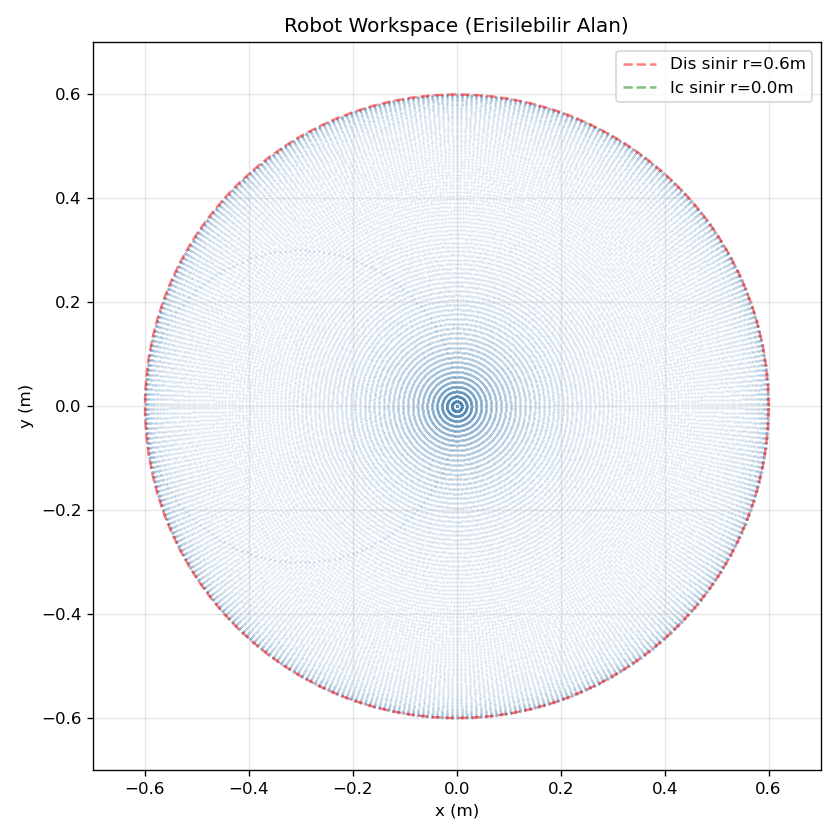
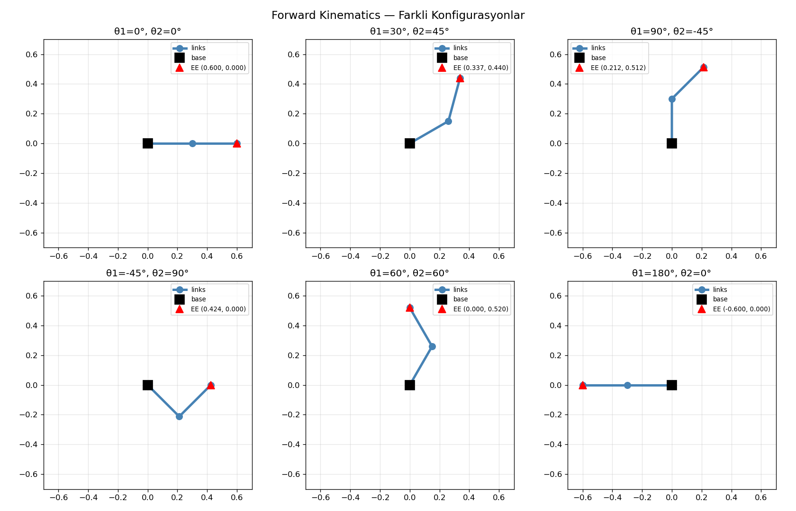

# A2: Forward Kinematics — Öğrenme Notu

## FK Nedir?

"Joint açıları verildiğinde end-effector nerede?" sorusunun cevabı.

```
Girdi:  θ₁, θ₂ (joint açıları, rad)
Çıktı:  (x, y) end-effector pozisyonu (m)
```

FK, robotikteki en temel hesaplama. IK bunun tersi, Jacobian bunun türevi.

---

## Geometric FK — 2-Link Planar

DH parametreleri 2-link için overkill. Geometric yaklaşım daha sezgisel:

```
Joint 2 pozisyonu (link1'in ucu):
  x₁ = L₁ · cos(θ₁)
  y₁ = L₁ · sin(θ₁)

End-effector pozisyonu:
  x = L₁ · cos(θ₁) + L₂ · cos(θ₁ + θ₂)
  y = L₁ · sin(θ₁) + L₂ · sin(θ₁ + θ₂)
```

**Kritik nokta:** `θ₁ + θ₂` — joint2 açısı *göreceli* (link1'e göre). Mutlak açı = θ₁ + θ₂.

### Elle Hesap Doğrulaması (θ₁=30°, θ₂=45°)

```
x = 0.3·cos(30°) + 0.3·cos(75°) = 0.2598 + 0.0776 = 0.3375
y = 0.3·sin(30°) + 0.3·sin(75°) = 0.1500 + 0.2898 = 0.4398
```

---

## Homogeneous Transformation

3x3 matris (2D) ile aynı sonucu chain rule ile elde ediyoruz:

```
T₀₁ = | cos(θ₁)  -sin(θ₁)  L₁·cos(θ₁) |
      | sin(θ₁)   cos(θ₁)  L₁·sin(θ₁) |
      |    0         0          1        |

T₁₂ = | cos(θ₂)  -sin(θ₂)  L₂·cos(θ₂) |
      | sin(θ₂)   cos(θ₂)  L₂·sin(θ₂) |
      |    0         0          1        |

T₀₂ = T₀₁ · T₁₂   →   EE pozisyonu = T₀₂[:2, 2]
```

**Neden önemli:** 6+ DOF robota geçince geometric yaklaşım zorlaşır, ama chain rule (T₀₁ · T₁₂ · ... · Tₙ₋₁,ₙ) her zaman çalışır.

---

## MuJoCo Doğrulaması

10 farklı açı kombinasyonu test edildi. Sonuç: **0.000000 m hata** (birebir eşleşme).

| θ₁ | θ₂ | FK x | FK y | MuJoCo x | MuJoCo y | Hata |
|---|---|---|---|---|---|---|
| 0° | 0° | +0.6150 | +0.0000 | +0.6150 | +0.0000 | 0 |
| 30° | 45° | +0.3413 | +0.4543 | +0.3413 | +0.4543 | 0 |
| 90° | -45° | +0.2227 | +0.5227 | +0.2227 | +0.5227 | 0 |
| 180° | 0° | -0.6150 | +0.0000 | -0.6150 | +0.0000 | 0 |

**Not:** Model XML'deki end_effector site'ı `pos="0.015 0 0"` offset'ine sahip (gripper ucu). FK hesabında bu offset'i `EE_OFFSET` olarak eklediğimizde tam eşleşme sağlandı. Offset'siz FK, link2'nin ucunu verir — site pozisyonu bundan 1.5cm ileride.

---

## Workspace



- **Dış sınır:** r = L₁ + L₂ = 0.6m (kollar tam uzanmış)
- **İç sınır:** r = |L₁ - L₂| = 0.0m (eşit uzunlukta linkler → merkeze ulaşabilir)
- Eşit link uzunlukları → workspace tam bir disk (delik yok)

---

## Konfigurasyon Örnekleri



---

## Öğrenilen Dersler

1. **Geometric FK basit ama güçlü.** 2-link için trigonometri yeterli, DH gereksiz.
2. **Site offset'e dikkat.** MuJoCo'daki `site` pozisyonu link ucuyla aynı olmayabilir — modeldeki offset'i bilmek lazım.
3. **Homogeneous transformation = chain rule.** Her link için bir T matrisi, çarp ve bitir. 6DOF'a ölçeklenir.
4. **Workspace = erişilebilir alan.** L₁ = L₂ ise tam disk, L₁ ≠ L₂ ise halka (annulus).

---

## Sonraki Adım: Jacobian (A3)

FK'nın türevini alırsak Jacobian'ı elde ederiz: "joint hızları → end-effector hızı" dönüşümü.
