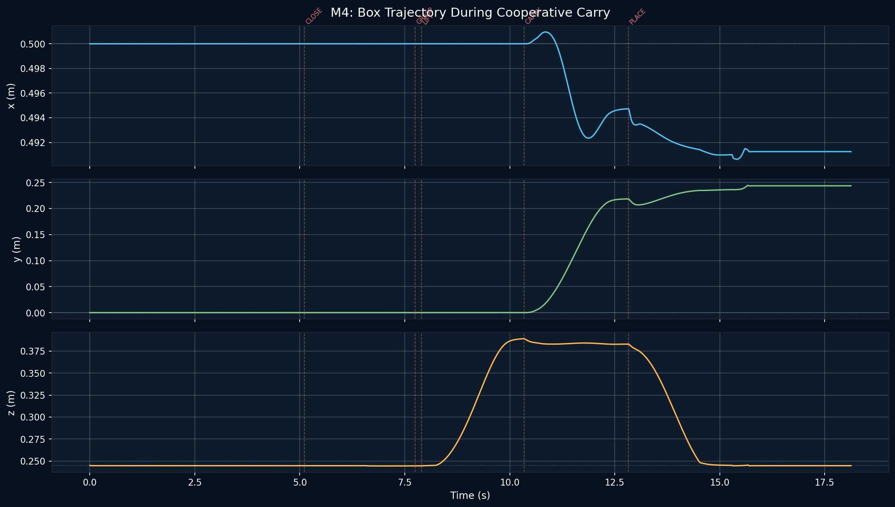

# Lab 6: Dual-Arm Coordination

Cooperative bimanual manipulation with **two UR5e arms** in MuJoCo. The arms grasp a box from opposite sides, lift it, carry it laterally, and place it back on the table. Verification is milestone-based: each of M0–M5 ends with explicit numerical gate criteria and a recorded artifact (video or screenshot).

## Showcase

[`media/m5_capstone.mp4`](media/m5_capstone.mp4) — end-to-end cooperative carry with state-name overlay.



> Both arms approach the box from opposite sides with collision-free trajectories synced to within 2 ms, weld-constraint-grasp the box, lift it 15 cm, carry it 22 cm in +y, and place it back on the table to within 0 cm dz / 4° rotation error.

## Key Results

| Milestone | Description | Gate Result |
|---|---|---|
| M0 | Scene validation: 12 joints + freejoint, EE z-dot=1.0 | passed |
| M1 | Independent joint PD + gravity comp | Max error **0.000247 rad** / max vel 0.00187 rad/s |
| M2 | Pinocchio dual-arm FK + DLS IK | FK error **0.000 mm** / IK 20/20 6-DOF + 5/5 pos-only |
| M3 | Coordinated approach to box | L Cartesian err **0.10 mm**, R **0.09 mm**, arrival sync **2.0 ms** |
| M4 | Cooperative carry (6-state pipeline) | Lift **15 cm**, carry **22 cm**, place dz **0.0 cm**, rot **4°** |
| M5 | Capstone demo + 1553-line architecture doc | video + blog post + walkthrough |

---

## Skills Demonstrated

- **Dual-arm MJCF scene**: 12 arm joints + 1 freejoint (box), 12 motor actuators, narrowed table to avoid arm-table collision, both EE z-axes pointing down.
- **Pinocchio dual-arm kinematics**: `DualArmModel` with FK / Jacobian / DLS IK using a Lab 3 Menagerie-matching kinematic chain; FK round-trip matches MuJoCo to machine precision across 20 configs.
- **Collision-free IK search**: 300 random restarts with MuJoCo contact check during IK candidate evaluation, plus joint-wrapping and step clamping for stability across large reconfigurations.
- **Chained IK for sequenced poses**: grasp pose seeded from approach pose (0.68 rad transition distance) to keep wrist on one side and avoid singular flips.
- **Weld-constraint grasping**: deterministic box attachment via MuJoCo welds with runtime relpose locking (`_set_weld_relpose`) instead of friction-based grasping.
- **Smooth-step bimanual motion**: 2 s ramped interpolation with `Kp=300, Kd=40` during weld-active phases keeps both arms in sync without overshoot.
- **Workspace-aware planning**: carry in +y because +x is infeasible with 1 m arm spacing; place uses absolute z target `TABLE_SURFACE_Z + box_half_z` with explicit retraction.

---

## Architecture

```text
Two UR5e arms (base 1.0 m apart, identical orientation)
        │
        ▼
┌──────────────────────────────┐
│  Pinocchio dual-arm model     │
│  FK + Jacobian + DLS IK       │
└──────────┬───────────────────┘
           │ q_left, q_right
           ▼
┌──────────────────────────────┐
│  BimanualStateMachine (6 st.) │
│  APPROACH → CLOSE → GRASP →   │
│  LIFT → CARRY → PLACE         │
└──────────┬───────────────────┘
           │ joint targets + weld toggles
           ▼
┌──────────────────────────────┐
│  Joint PD + gravity comp      │
│  τ = Kp·Δq + Kd·Δq̇ + qfrc_bias │
└──────────┬───────────────────┘
           │ torques (per arm)
           ▼
┌──────────────────────────────┐
│  MuJoCo dual-arm scene        │
│  + weld constraints + box     │
└──────────────────────────────┘
```

Pinocchio handles FK/IK/Jacobian. MuJoCo handles physics, weld constraints, and contact. No Cartesian impedance — joint PD + gravity compensation is reliable across the large reconfigurations Lab 6 needs.

---

## Modules

| File | Role |
|---|---|
| `src/lab6_common.py` | Shared constants and utilities |
| `src/dual_arm_model.py` | Pinocchio FK, Jacobian, DLS IK (with multi-start + step clamping) |
| `src/joint_pd_controller.py` | Joint PD + gravity compensation |
| `src/grasp_pose_calculator.py` | Approach + grasp SE(3) poses from box pose |
| `src/bimanual_state_machine.py` | 6-state cooperative carry pipeline |
| `src/m0_validate_scene.py` … `src/m5_capstone_demo.py` | Per-milestone gate scripts |

---

## Quick Start

```bash
# From the repository root
pip install mujoco numpy pinocchio scipy "imageio[ffmpeg]" matplotlib

# Run milestones in order — each ends with a gate check + artifact
python3 lab-6-dual-arm/src/m0_validate_scene.py
python3 lab-6-dual-arm/src/m1_independent_motion.py
python3 lab-6-dual-arm/src/m2_fk_validation.py
python3 lab-6-dual-arm/src/m2_ik_validation.py
python3 lab-6-dual-arm/src/m3_coordinated_approach.py
python3 lab-6-dual-arm/src/m4_cooperative_carry.py

# Capstone — full pipeline with state-name overlay
python3 lab-6-dual-arm/src/m5_capstone_demo.py
```

Each milestone script writes a video or screenshot to `media/` and prints the gate result on stdout.

---

## Structure

```text
lab-6-dual-arm/
├── src/              Milestone scripts + shared kinematics / controller / state machine
├── models/           scene_dual.xml + ur5e_left.xml + ur5e_right.xml + Pinocchio URDF
├── docs/             ARCHITECTURE.md (1553 lines), CODE_WALKTHROUGH.md (765 lines)
├── docs-turkish/     ARCHITECTURE_TR.md (569 lines)
├── blog/             "From One Arm to Two" technical narrative (2460 words)
├── media/            Per-milestone videos + screenshots + trajectory plots
└── tasks/            TODO / LESSONS (12 logged bugs with symptom/root-cause/fix/takeaway)
```

---

## Verification Model

Lab 6 ships **milestone gates rather than a unit-test suite**. Each milestone script runs end-to-end, asserts on numerical gate criteria (e.g. M2 requires FK round-trip < 0.5 mm and IK ≥ 18/20 converged), and writes a video or screenshot to `media/` as evidence. Earlier rounds of Lab 6 had a unit-test suite, but it was removed during the milestone-based restructure (commit `6c6dc86`) because the milestone scripts already exercise every module end-to-end against MuJoCo with explicit numerical thresholds.

---

## Documentation

| Document | English | Turkish |
|---|---|---|
| Architecture (7 sections + appendix) | [`docs/ARCHITECTURE.md`](docs/ARCHITECTURE.md) | [`docs-turkish/ARCHITECTURE_TR.md`](docs-turkish/ARCHITECTURE_TR.md) |
| Code walkthrough | [`docs/CODE_WALKTHROUGH.md`](docs/CODE_WALKTHROUGH.md) | — |
| Blog post | [`blog/lab6_dual_arm.md`](blog/lab6_dual_arm.md) | — |

---

## Media

- M0 scene screenshot: [`media/m0_scene.png`](media/m0_scene.png)
- M1 independent motion: [`media/m1_independent.mp4`](media/m1_independent.mp4)
- M2 IK visual checks: `media/m2_ik_{left,right}_{1,2}.png`
- M3 approach: [`media/m3_approach.mp4`](media/m3_approach.mp4), [`media/m3_final.png`](media/m3_final.png)
- M4 cooperative carry: [`media/m4_carry.mp4`](media/m4_carry.mp4), [`media/m4_box_trajectory.png`](media/m4_box_trajectory.png)
- M5 capstone: [`media/m5_capstone.mp4`](media/m5_capstone.mp4), [`media/m5_trajectory.png`](media/m5_trajectory.png)

---

## Key Lessons Learned

1. Both arms must have **identical base orientation**. Facing direction is handled by IK targets, not by base rotation.
2. The "standard" UR5e URDF does **not** match the MuJoCo Menagerie kinematic chain. Lab 3's hand-tuned URDF is required for FK/IK to agree with simulation.
3. Weld constraint `eq_data` must be updated to the current relative pose **before** activation, otherwise the box jumps.
4. IK solutions must be collision-checked against the **full scene**, not just kinematic limits.
5. Large joint reconfigurations need **ramped interpolation**, not step commands.

See [`tasks/LESSONS.md`](tasks/LESSONS.md) for all 12 lessons with symptom / root-cause / fix / takeaway entries.

---

## License

The Lab 6 source code and original documentation are covered by the repository root [Apache-2.0 license](../LICENSE).

Bundled robot description packages and model assets in [`models/`](models/) and the Menagerie assets reused from Lab 2 keep their upstream licenses. See the repository root [THIRD_PARTY_NOTICES.md](../THIRD_PARTY_NOTICES.md) for the exact carve-outs.
