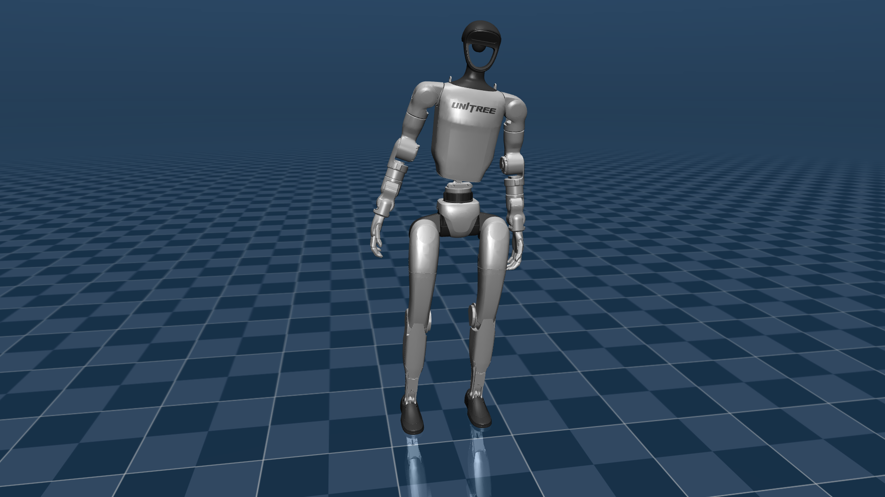

# Lab 7: Locomotion Fundamentals

Bipedal locomotion on the **Unitree G1 humanoid** (29 DOF, 33.34 kg) using MuJoCo simulation and Pinocchio analytical computation. Lab 7 takes the floating-base / quaternion / whole-body machinery as far as the available actuator model allows, and **honestly documents the structural limit** at which classical ZMP walking with position actuators stops being feasible.

## Showcase

[`media/m5_capstone.mp4`](media/m5_capstone.mp4) — capstone demo: standing under 5 N push + 5 cm lateral weight shift + LIPM/ZMP plot overlay.



> A 5 cm lateral CoM weight shift on the real Menagerie G1 with feet pinned by stacked-Jacobian whole-body IK. Foot drift stays under 1.4 mm; CoM tracks to 53.5 mm of shift; pelvis Z stays above 0.789 m.

> **Status note — scope deferral**: Static balance, push recovery, FK/IK validation, and quasi-static weight shifting all pass their gates. Dynamic walking (M4) was attempted (M3e, 6 distinct approaches) and identified as **structurally infeasible with the Menagerie G1's position actuators**: ZMP regulation needs ankle torque, and position-PD actuators cannot deliver it. The lab is signed off at M3d scope with M5 documentation explaining why, rather than papering over the limit. See [Scope Deferral](#scope-deferral) below.

## Key Results

| Milestone | Description | Gate Result |
|---|---|---|
| M0 | Load G1, joint map, freefall demo | passed |
| M1 | Standing balance + 5 N push recovery | **1.6 mm** pelvis deviation (gate 5 cm) |
| M2 | CoM cross-validation (Pinocchio vs MuJoCo) + support polygon | **0.000 mm** CoM error / **100 %** inside polygon |
| M3a | Pinocchio Jacobian validation against finite diffs | **0/36** failures, max error 1.09e-07 |
| M3b | FK cross-validation, 10 random leg configs | **0.0000 mm** foot + CoM error |
| M3c | Whole-body IK (stacked Jacobian DLS, 18 tasks) | **0.13 mm** CoM error, **0.51 mm** foot slip on 5 cm shift |
| M3d | Quasi-static weight shift in simulation | **53.5 mm** shift / drift **0.70 mm** (L) / **1.36 mm** (R) |
| M3e | Dynamic ZMP walking | **FAILED** — structural limitation, see notes |
| M5 | Documentation + capstone | 6-section ARCHITECTURE.md + blog + capstone video |
| Tests | Standing / IK / LIPM unit tests | **34 test methods** across `tests/test_standing.py` (9), `tests/test_ik.py` (7), `tests/test_lipm.py` (18) |

---

## Skills Demonstrated

- **Floating-base configuration handling**: `nq ≠ nv` for free-flyer joints; configuration integration via `pin.integrate(...)` rather than naïve `q += dq`. Quaternion convention mapping documented: MuJoCo `(w,x,y,z)` ↔ Pinocchio `(x,y,z,w)` with a 0.793 m Z-offset between pelvis frames.
- **Pinocchio frame discipline**: all Jacobians taken in `pin.LOCAL_WORLD_ALIGNED`, validated column-by-column against finite differences (eps=1e-6) — every column flagged as sign-correct before any control law is built on top.
- **CoM cross-validation**: Pinocchio CoM vs MuJoCo `subtree_com[pelvis]` agree to **machine precision** (0.000 mm) after the pelvis Z-offset is taken into account.
- **Stacked-Jacobian whole-body IK**: 18 task rows (feet 6D × 2 + CoM_XY 2 + pelvis_Z 1 + pelvis_orientation 3) solved with damped least squares; identity test converges in 0 iterations, 5 cm lateral shift converges in 20 with sub-millimetre foot slip.
- **LIPM + ZMP preview control implementation**: full Kajita-2003 preview controller, ZMP reference generator, and cubic + parabolic swing foot trajectory — implemented in full and used to *diagnose* why position actuators cannot regulate ZMP.
- **Honest negative result**: 6 distinct ZMP-walking attempts with varying gains / feedforward / timing / IK strategies, each documented; conclusion (position actuators ⇒ no ankle torque ⇒ no ZMP control authority) treated as a real engineering finding rather than buried.

---

## Architecture

```text
Pinocchio (analytical)          MuJoCo (simulation)
├─ FK, Jacobians                ├─ Physics stepping
├─ CoM computation              ├─ Contact dynamics
├─ Whole-body IK (stacked DLS)  ├─ Position actuators
└─ Frame placements             └─ Video rendering
```

Pinocchio computes all kinematics analytically. MuJoCo runs the physics. Cross-validation between the two confirms correctness at every milestone before the next builds on top.

Standing / weight-shift control law (position-PD with gravity feedforward):

```
ctrl = q_target + qfrc_bias[6:35] / Kp - K_VEL * qvel[6:35] / Kp
```

---

## Modules

| File | Role |
|---|---|
| `src/lab7_common.py` | Constants, model loading, quaternion utilities |
| `src/standing_controller.py` | Gravity-compensated PD standing |
| `src/whole_body_ik.py` | Stacked-Jacobian DLS whole-body IK |
| `src/lipm_planner.py` + `src/lipm_preview_control.py` | LIPM model + Kajita preview controller |
| `src/zmp_reference.py` | Footstep planner + ZMP reference generator |
| `src/swing_trajectory.py` | Cubic + parabolic swing foot trajectory |
| `src/m0_explore_g1.py` … `src/m5_capstone_demo.py` | Per-milestone scripts |

---

## Quick Start

```bash
# From the repository root
pip install mujoco numpy pinocchio scipy "imageio[ffmpeg]" matplotlib
```

> **External model dependency**: Lab 7 expects the Unitree G1 Menagerie assets at `<repo-parent>/vla_zero_to_hero/third_party/mujoco_menagerie/unitree_g1/`. Update the path in `src/lab7_common.py` if your checkout layout differs.

```bash
# Run milestones in order — each ends with a gate check + artifact
python3 lab-7-locomotion/src/m0_explore_g1.py
python3 lab-7-locomotion/src/m1_standing.py
python3 lab-7-locomotion/src/m2_com_balance.py
python3 lab-7-locomotion/src/m3a_pinocchio_validation.py
python3 lab-7-locomotion/src/m3b_foot_fk_validation.py
python3 lab-7-locomotion/src/m3c_static_ik.py
python3 lab-7-locomotion/src/m3d_weight_shift.py

# Capstone — standing + push + weight shift + LIPM plot overlay
python3 lab-7-locomotion/src/m5_capstone_demo.py

# Unit tests (standing / whole-body IK / LIPM)
python3 -m pytest lab-7-locomotion/tests -q
```

---

## Structure

```text
lab-7-locomotion/
├── src/              Milestone scripts + standing / whole-body IK / LIPM modules
├── models/           Lab-side overlay files (primary G1 mesh comes from Menagerie)
├── docs/             ARCHITECTURE.md, CODE_WALKTHROUGH.md, g1_joint_map.md
├── docs-turkish/     ARCHITECTURE_TR.md
├── blog/             "Why Making a Humanoid Walk is Harder Than It Looks"
├── media/            Per-milestone videos + plots + validation .txt artifacts
├── tests/            Pytest suite (34 methods across standing / IK / LIPM)
└── tasks/            TODO / LESSONS
```

---

## Scope Deferral

**M4 (ZMP walking) is deferred as a structural limitation, not as remaining work.**

After M3d validated quasi-static balance, M3e attempted dynamic ZMP walking through 6 distinct approaches (varying preview-controller gains, feedforward terms, swing-foot timing, and IK warm-start strategies). Every attempt failed at the same point: **the Menagerie G1 uses position actuators, and ZMP regulation requires ankle torque, which position-PD actuators cannot deliver.** This is not a tuning problem — it is the actuator model.

The capstone (`m5_capstone_demo.py`) demonstrates what *does* work — standing under push, 5 cm weight shift — and the LIPM/ZMP code is left in `src/` as evidence of the diagnostic work. The full failure analysis is in [`docs/ARCHITECTURE.md`](docs/ARCHITECTURE.md) (section on M3e + ZMP) and the [blog post](blog/lab7_locomotion.md).

Unblocking M4 requires either (a) torque-controlled actuators (which would mean retargeting to a different humanoid or rebuilding G1's actuator model), or (b) an RL policy that learns to walk through position actuators despite the dynamic limitation. Both are real Lab-8 / Lab-9 directions rather than Lab-7 follow-ups.

---

## Documentation

| Document | Path |
|---|---|
| Architecture (6 sections) | [`docs/ARCHITECTURE.md`](docs/ARCHITECTURE.md) |
| Architecture (Turkish) | [`docs-turkish/ARCHITECTURE_TR.md`](docs-turkish/ARCHITECTURE_TR.md) |
| Code walkthrough | [`docs/CODE_WALKTHROUGH.md`](docs/CODE_WALKTHROUGH.md) |
| G1 joint map | [`docs/g1_joint_map.md`](docs/g1_joint_map.md) |
| Blog post | [`blog/lab7_locomotion.md`](blog/lab7_locomotion.md) — *"Why Making a Humanoid Walk is Harder Than It Looks"* |

---

## Media

| File | Content |
|---|---|
| `media/m0_freefall.mp4` | G1 freefall (no control) |
| `media/m1_standing.mp4` | 10 s standing + 5 N push recovery |
| `media/m2_com_balance.mp4` | CoM balance controller |
| `media/m3d_weight_shift.mp4` | 5 cm lateral weight shift |
| `media/m3e_zmp_walking.mp4` | M3e walking attempt (kept as documented failure) |
| `media/m5_capstone.mp4` | Capstone — all working phases + LIPM plot |
| `media/m5_plots.png` | Capstone trajectory plots + LIPM overlay |
| `media/m3a_jacobian_validation.txt` / `m3b_fk_validation.txt` / `m3c_ik_results.txt` | Numerical validation logs |

---

## Connection to Prior Labs

| Lab | Pattern Reused |
|---|---|
| Lab 3 | PD control, gravity compensation, Menagerie feedforward pattern |
| All | Cross-validation discipline (Pinocchio vs MuJoCo at every step) |

Floating-base dynamics, quaternion-manifold integration, and stacked-Jacobian whole-body IK are new in Lab 7. No code is imported from Labs 1–6.

---

## License

The Lab 7 source code and original documentation are covered by the repository root [Apache-2.0 license](../LICENSE).

The Unitree G1 model is **not** bundled in this repository — it must be obtained from the upstream MuJoCo Menagerie. The G1 model's own license terms apply at that source. See the repository root [THIRD_PARTY_NOTICES.md](../THIRD_PARTY_NOTICES.md) for the lab's other carve-outs.
