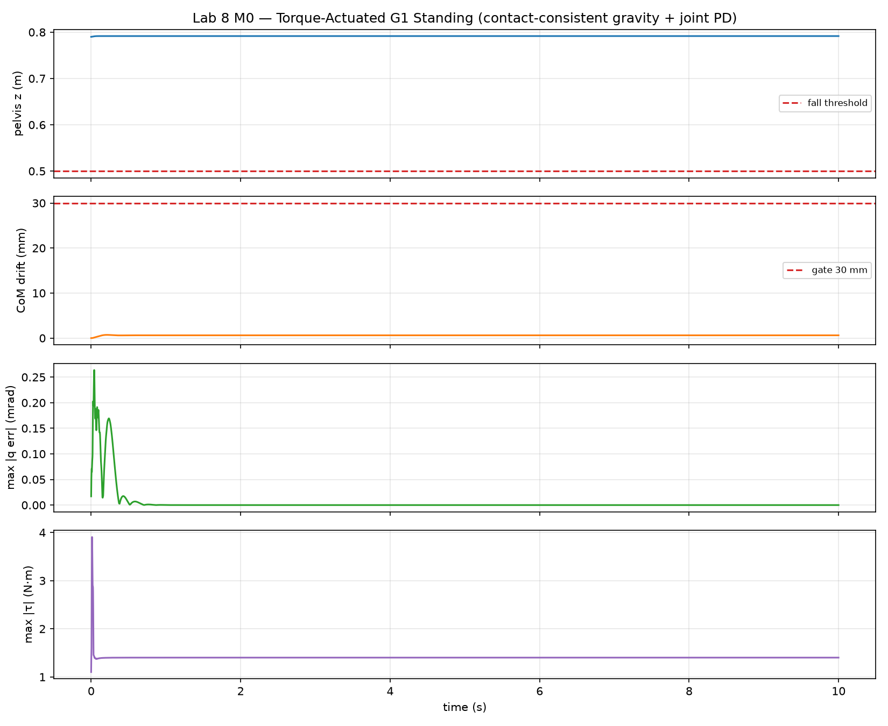
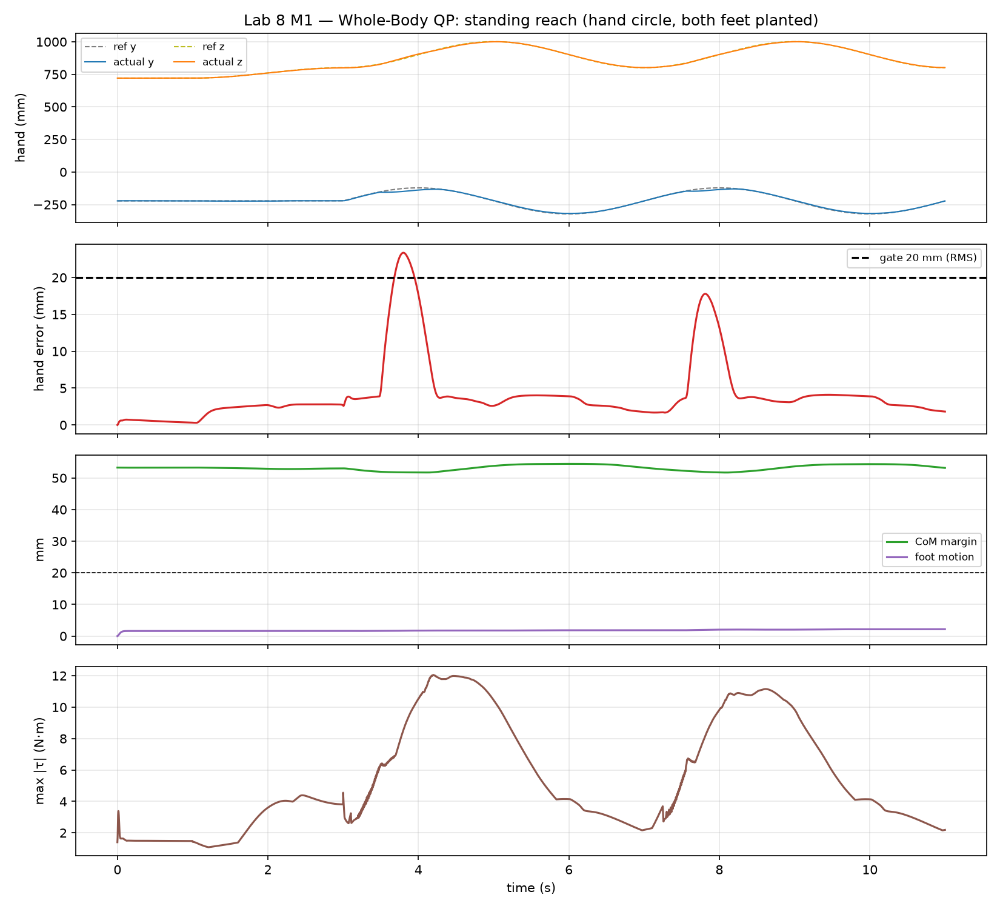
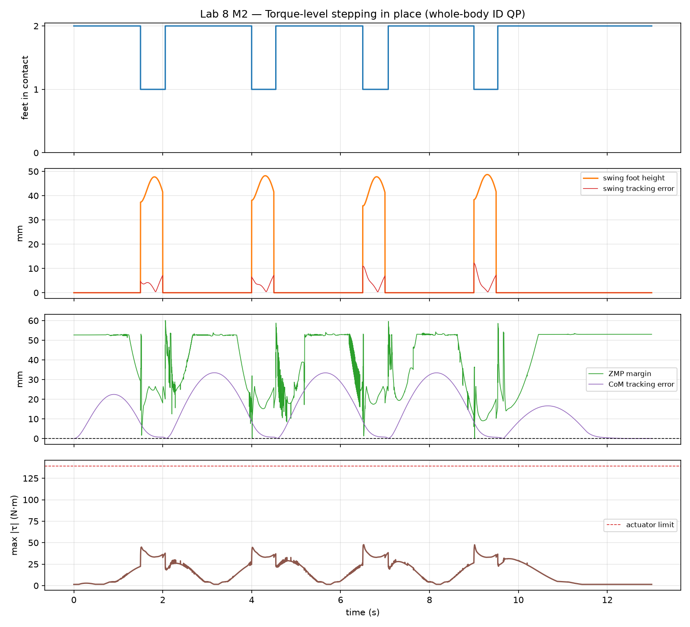
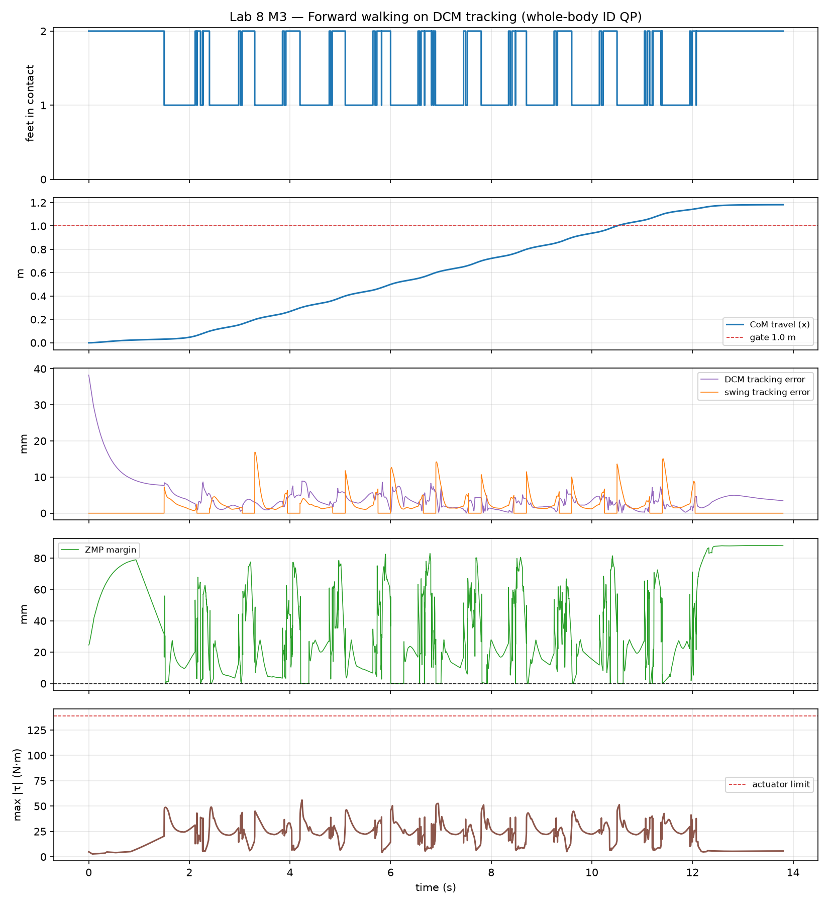

# Lab 8 — Whole-Body Loco-Manipulation

> **Status:** 🚧 In progress — **M0–M3 complete** (M3 closed 2026-08-16), M4 next.
> **Platform:** Unitree G1 (MuJoCo Menagerie, 29 DOF) under **torque** control + Pinocchio
> **Goal:** A humanoid that walks and uses its hands at the same time — the operating
> mode Lab 9's VLA policy will have to produce.

Lab 7 took the G1 as far as its position servos allow: standing balance and
quasi-static weight shifting worked, and dynamic ZMP walking provably did not
(6 attempts; IK converged, PD replay diverged). The diagnosis was the actuator
model. **Lab 8 is the test of that diagnosis** — it re-actuates the G1 with
torque motors and rebuilds the control stack as whole-body QP → inverse
dynamics → joint torques, owning gait generation rather than inheriting it.

---

## Milestones

| # | Milestone | Gate | Status |
|---|---|---|---|
| M0 | Torque-actuated G1 bring-up | 10 s stand, CoM drift < 30 mm, model parity < 1e-6 | ✅ **PASS** |
| M1 | Whole-body QP (standing reach) | hand RMS < 20 mm, CoM inside support polygon | ✅ **PASS** |
| M2 | Torque-level stepping | 4 in-place steps, ZMP inside polygon > 95% stance | ✅ **PASS** |
| M3 | Forward walking | ≥ 10 steps, ≥ 1.0 m, no fall | ✅ **PASS** |
| M4 | Walk + arm task | M3 gate holds, hand error < 50 mm while walking | ⏳ next |
| M5 | Loco-manipulation capstone | walk → grasp → carry → place, object within 50 mm | — |
| M6 | Documentation & blog | docs EN/TR + blog post | — |

---

## M0 — Torque-Actuated G1 Bring-Up ✅

Menagerie ships the G1 with 29 `<position kp="500">` servos. Those compute a PD
law *inside* MuJoCo, which means the only available command is a joint angle —
there is nowhere to inject a torque from an inverse-dynamics pipeline. M0
replaces them with `<motor>` actuators and re-establishes standing from outside
the simulator.

```bash
MUJOCO_GL=egl python3 lab-8-loco-manipulation/src/m0_torque_standing.py
pytest lab-8-loco-manipulation/tests/          # 62 tests (M0 + M1 + M2)
```

### Gate results

| Criterion | Result | Measured |
|---|---|---|
| Stands 10 s without falling | PASS | no fall |
| CoM horizontal drift < 30 mm | PASS | **0.71 mm** |
| Both feet in contact at end | PASS | yes |
| CoM inside support polygon | PASS | 52.7 mm margin |
| g(q) parity vs MuJoCo `qfrc_bias` | PASS | 1.74e-16 (relative) |
| M(q) parity vs MuJoCo `mj_fullM` | PASS | 9.32e-17 (relative) |
| Torque command authority | PASS | motor actuators, 5–139 N·m |



Video: [`media/m0_torque_standing.mp4`](media/m0_torque_standing.mp4)

### What M0 actually measured

The milestone is not "the robot stands" — position servos did that for free in
Lab 7. It is *which terms are needed once they are gone*, so the ablation is
part of the deliverable:

| Gravity mode | Result | CoM drift | Steady joint error | \|τ\|max |
|---|---|---|---|---|
| none (pure joint PD) | STAND | 0.18 mm | 2.77 mrad | 1.4 N·m |
| free-space `g(q)` | STAND | 0.96 mm | 1.40 mrad | 1.6 N·m |
| contact-consistent `g(q) − τ_c` | STAND | 0.62 mm | **0.00 mrad** | 3.9 N·m |
| `g(q)` alone, no PD | **FELL** | — | collapses to 0.097 m in ~2 s | — |

Two findings worth carrying forward (full write-ups in
[`tasks/LESSONS.md`](tasks/LESSONS.md)):

- **Gravity compensation alone cannot stand.** It cancels weight without
  stabilising posture; a standing humanoid is an inverted pendulum. Every
  stabilising term the servo used to provide has to be re-supplied explicitly.
- **Inertia-shaping the PD gains makes the G1 fall** — and that fix
  (`τ = M(q)(Kp·e + Kd·ė) + g`) was inherited from Lab 5, where it was correct.
  `M(q)[6:,6:]` on a *floating* base is not the reflected inertia a standing
  robot feels through its closed leg chains; multiplying gains by it saturates
  the actuators. Raw joint-space gains stand with 0.18 mm drift. An inherited
  fix is only valid inside the assumptions that produced it.

---

## M1 — Whole-Body QP, Standing Reach ✅

The G1 stands on both feet under torque control while its right hand traces two
laps of a 10 cm circle. Balance, stance feet, hand and posture are resolved by a
single inverse-dynamics QP per tick.

```bash
MUJOCO_GL=egl python3 lab-8-loco-manipulation/src/m1_standing_reach.py
```

| Criterion | Result | Measured |
|---|---|---|
| No fall | PASS | stood 11 s |
| Hand tracking RMS < 20 mm | PASS | **7.08 mm** |
| CoM margin ≥ 20 mm inside support polygon | PASS | 51.7 mm min |
| Stance feet move < 5 mm | PASS | 2.19 mm |
| Torques within limits | PASS | 12.0 N·m peak (limit 139) |



Video: [`media/m1_standing_reach.mp4`](media/m1_standing_reach.mp4)

### The finding: a kinematic QP cannot balance

`plan/LAB_08.md` specifies the QP as `min ‖J q̇ − ẋ_d‖²` — velocity level. That
version was built first, and it fell over during every reach. The diagnostic that
named the bug: **making the hand task stronger made the robot fall sooner**
(weights 1e2 → 1e4 all fell; only a weak, badly-tracking hand task survived). A
controller that degrades as you ask it to do its job is optimising the wrong
variable.

The reason is physical, not numerical. A velocity-level QP can hold
`J_com q̇ = 0` exactly while the robot rotates about its ankles, because CoM
motion is produced by **contact forces**, which that formulation does not
represent. So M1 solves at the acceleration level with the contact wrenches as
decision variables:

```
min_{q̈,f}  Σ w‖J q̈ + J̇q̇ − ẍ_des‖² + λ_a‖q̈‖² + λ_f‖f‖²
s.t.  M[:6] q̈ + h[:6] = J_cᵀ[:6] f     (unactuated floating base)
      J_c q̈ + J̇_c q̇ = 0               (stance feet don't accelerate)
      friction pyramid · CoP inside foot · f_z ≥ f_min · |τ| ≤ τ_max
τ  =  M[6:] q̈ + h[6:] − J_cᵀ[6:] f
```

47 variables, **0.11 ms** mean solve — 1 kHz control with room to spare. Now
strengthening the hand task *improves* tracking, which is the sanity check that
the formulation is right. `wb_qp.py` (velocity level) is kept for genuinely
kinematic sub-problems and labelled as unsuitable for balance.

A second, cheaper win: adding the trajectory's own ẋ_ref/ẍ_ref as feedforward
cut hand RMS from 18.63 mm to 7.08 mm with no gain change — the residual had
been almost entirely tracking lag.

---

## M2 — Torque-Level Stepping ✅

Four alternating in-place steps under torque control. The gait schedule decides
phases and swing references; the QP's contact set follows what the ground
actually confirms.

```bash
MUJOCO_GL=egl python3 lab-8-loco-manipulation/src/m2_stepping.py
```

| Criterion | Result | Measured |
|---|---|---|
| 4 steps without falling | PASS | **4/4** |
| ZMP inside support polygon > 95 % | PASS | **98.7 %** of loaded ticks |
| Torques within limits | PASS | 49.6 N·m peak (limit 139) |



Video: [`media/m2_stepping.mp4`](media/m2_stepping.mp4)

### The finding: commanding CoM *height* is what saturated the actuators

The first working version reached 3 of 4 steps and fell during the fourth
weight transfer, with peak torque pinned at exactly the 139 N·m limit.
Instrumenting per-joint saturation named the culprit, and it was not a leg:
**waist roll** (50 N·m) saturated first and for the most ticks, followed by
waist pitch and the 25 N·m shoulders.

The cause was a task nobody had asked for. Controlling the CoM in all three
axes means holding the pelvis at a constant *height* while it translates
laterally over the stance foot — so the QP spends torque suppressing the
robot's natural dip, and the torso pays for it. Dropping to horizontal CoM
control (`axes=(0, 1)`) and relaxing the pelvis orientation task gives:

| | 3-axis CoM | horizontal CoM |
|---|---|---|
| Steps completed | 3 / 4 | **4 / 4** |
| Peak torque | 139.0 N·m (saturated) | **49.6 N·m** |
| Saturated ticks | 583 | **0** |

Two other defects had to be fixed first, both worth knowing:

- **The QP's contact set must be what the ground confirms, not what the
  schedule intends.** Taking stance straight from the timeline meant the
  solver planned against a foot that was still 60 mm in the air — it
  distributed wrenches through empty space and launched the robot (foot
  0.66 m up, fall at 4.0 s). The stance set is now the intersection of
  scheduled intent and *measured* contact.
- **Home poses must be measured on a settled robot.** Read at t=0 they sit
  ~10 mm below where the robot rests, so every touchdown fought a swing
  target buried in the floor.

Two plausible-sounding improvements were tried and measured to be **worse**,
recorded in [`tasks/LESSONS.md`](tasks/LESSONS.md) so nobody re-derives them:
a swing-foot orientation task (over-determines the swing leg) and heavier CoM
damping (the weight transfer has a deadline).

Timing is deliberately quasi-static — 2.0 s double support, 0.5 s swing, 15 mm
clearance. M3 has to compress that, and the honest expectation is that the
"shift weight, then swing" strategy runs out of road and gets replaced by
capture-point / DCM tracking. **That expectation was correct** — see M3.

---

## M3 — Forward Walking ✅

The milestone Lab 7 could not reach. Lab 7 deferred a "10+ steps" walking
capstone after six attempts, diagnosing the Menagerie G1's position servos as
the blocker; M3 is the test of that diagnosis, and it walks.

```bash
MUJOCO_GL=egl python3 lab-8-loco-manipulation/src/m3_walking.py
MUJOCO_GL=egl python3 lab-8-loco-manipulation/src/m3_walking.py --in-place  # M2 regression
```

| Criterion | Result | Measured |
|---|---|---|
| ≥ 10 steps without falling | PASS | **12 / 12** |
| Travelled ≥ 1.0 m | PASS | **1.18 m** |
| ZMP inside support polygon > 90 % | PASS | 99.3 % of loaded ticks |
| Torques within limits | PASS | 56.0 N·m peak (limit 139) |



Video: [`media/m3_walking.mp4`](media/m3_walking.mp4)

M2's in-place gate re-run through the *same* DCM controller — a regression
check that the new reference subsumes the old one rather than trading it away
— passes 4/4 steps with the ZMP inside the support polygon 100 % of the time
(`media/m3_inplace_regression.mp4`, `media/m3_inplace_metrics.png`). M0 and M1
were re-run unchanged after the QP changes and still pass.

### Stop commanding where the CoM is; command where it is going

M2 balanced by putting the CoM over whichever foot was about to take the load.
That needs a moment of rest over each foot, which forward walking never grants
— measured, it reached 3 of 10 steps and 0.22 m at every stride length and
double-support duration tried.

Under the linear inverted pendulum the CoM obeys `c̈ = ω²(c − p)` with
`ω = √(g/z_c)`, which splits into a convergent part that needs no control and a
**divergent** part `ξ = c + ċ/ω` obeying `ξ̇ = ω(ξ − p)`. Only `ξ` can run away,
and it is steered by the ZMP — which the whole-body QP can already place
anywhere inside the feet. So M3 plans a piecewise-linear ZMP through the
footsteps, back-integrates the DCM from a terminal rest condition, and commands

```
p_cmd = ξ − ξ̇_ref/ω + (k/ω)(ξ − ξ_ref)      →      c̈_des = ω²(c − p_cmd)
```

There is no CoM *position* task on the control path at all. The body is free to
travel; only its divergent component is regulated. That is precisely the
freedom the quasi-static rule lacked.

### The three fixes that mattered more than the control law

The first DCM run was **worse** than what it replaced: 2 of 12 steps, 0.32 m
*backwards*, with the commanded ZMP pinned at a foot edge on 53 % of ticks.
Reading the saturation rather than the error pointed away from the controller.

**1. The foot contact model was a symmetric guess.** `ContactSpec` described the
sole as a ±0.08 m box centred on the ankle. Menagerie's actual G1 foot is four
spheres spanning x ∈ [−0.05, 0.12], y ∈ ±0.025, sitting 35 mm *below* the frame
the contact wrench is expressed about. The guess simultaneously over-claimed
30 mm of rearward CoP the foot does not have — so the QP wrote wrenches MuJoCo
refused to produce — and discarded 40 mm of forward CoP, the authority that
decelerates the CoM before touchdown. Adding the true patch offset and the
`h·f` shear term in the CoP bound took the gait from 2 steps to 6, and
*improved* M2's in-place gate (ZMP inside 98.7 % → 100 %).

**2. A tighter QP tolerance was making the answer worse.** 38 % of ticks were
returning OSQP `maximum iterations reached` at 12.6 ms per solve. `eps = 1e-6`
is far below what a cost spanning weights 1e4…1e1 against a 1e-4 regularisation
can deliver, so the solver burned its whole budget not converging. At `1e-4`
every tick converges in ~25 iterations and **0.073 ms**, and the base-dynamics
residual *fell* from 0.021 to 8.5e-5 N·m.

Together these took commanded-vs-realised CoM acceleration from slope 0.78 with
a −0.09 m/s² bias (correlation 0.62) to slope 0.95, bias 0.04, **correlation
0.995**.

**3. Stance width dominates stride length.** The ZMP has to cross from one foot
to the other every step and the lateral DCM swings with it, so the cost of
lateral balance is set by how far apart the feet are — not by how far forward
they go, which the long axis of the foot arrests cheaply.

| Stance width | Steps | Distance | DCM RMS | ZMP clamped | Peak τ |
|---|---|---|---|---|---|
| 0.237 m (G1 rest stance) | 7/12, fell | 0.84 m | 121.5 mm | 40 % | 139 N·m |
| **0.18 m** | **12/12** | **1.18 m** | **6.2 mm** | 3 % | 56.0 N·m |
| 0.14 m | 12/12 | 1.19 m | 17.5 mm | 9 % | 59.9 N·m |

### Two corrections that had to be measured, not reasoned

**An integrator that helped, then hurt.**

A leaky integrator on the DCM error was added to cancel the −0.09 m/s² bias —
the textbook remedy, and it worked. Once the contact model and solver fixes
removed the bias at its source, the same integrator turned a passing gait into
a falling one (12/12 → 8/12, DCM RMS 6.2 → 118 mm). It survives in the code,
defaulting off, because it is the right tool against a disturbance you cannot
remove. The lesson is to re-measure a compensator after fixing what it was
compensating for.

**A fix to the plan's initial condition that halved the gait.** A DCM tracking
a ramping ZMP leads it by `k/ω`, so the plan starts with ξ ~30 mm off-centre
while the robot stands still — an initial-condition mismatch by every textbook
argument. Splitting the settle into a hold plus a short sweep removed it
cleanly, and took the gait from 12/12 steps to 6/12 (DCM RMS 6.2 → 129 mm).
The lead is not an error: it is the lateral momentum the first step needs, and
the settle is the robot acquiring it. Caught because the gate run disagreed
with a tuning sweep from an hour earlier, and that change was the only
difference.

---

## Architecture

```
gait refs (M2+)   hand target (M1+)
        │               │
        ▼               ▼
   task stack: DCM/CoM · feet · hand · posture (Pinocchio, LOCAL_WORLD_ALIGNED,
        │                                     with J̇q̇ drift + feedforward)
        ▼
   whole-body inverse-dynamics QP (OSQP)
   variables: joint accelerations q̈  +  contact wrenches f
   constraints: unactuated base dynamics · stance contacts ·
                friction / CoP / unilateral · torque limits
        │
        ▼
   τ read out of the actuated rows
        │
        ▼
   MuJoCo, torque actuators, 1 kHz
```

Full module map, data flow and interface contracts:
[`tasks/ARCHITECTURE.md`](tasks/ARCHITECTURE.md).
Milestone plan and gates: [`tasks/PLAN.md`](tasks/PLAN.md).

### Modules

| File | Role |
|---|---|
| `src/g1_torque_model.py` | Builds the torque-actuated G1 from Menagerie via `MjSpec` (servos → motors, limits from `actuatorfrcrange`, floor, keyframe hygiene) |
| `src/lab8_common.py` | Paths, constants, model loaders, MuJoCo↔Pinocchio state conversion, CoM / contact / support-polygon helpers |
| `src/standing_controller.py` | Joint PD + selectable gravity mode (`none` / `free_space` / `contact_consistent`) |
| `src/m0_torque_standing.py` | M0 gate: cross-validation, ablation, recorded 10 s hold |
| `src/wb_tasks.py` | M1: CoM / frame-position / frame-pose / posture tasks — Jacobians, `J̇q̇` drift, feedforward |
| `src/wb_id_qp.py` | M1: acceleration-level inverse-dynamics QP with contact wrenches (the control path) |
| `src/wb_qp.py` | M1: velocity-level QP — kinematic sub-problems only, **not** balance |
| `src/m1_standing_reach.py` | M1 gate: hand-circle reach with both feet planted |
| `src/gait_planner.py` | M2: phase timeline, contact sets, swing references with feedforward, CoM weight shift |
| `src/locomotion_controller.py` | M2: gait → QP wiring; measured-contact stance set, swing task ramp-in, ZMP telemetry |
| `src/m2_stepping.py` | M2 gate: four in-place steps |
| `src/dcm_planner.py` | M3: piecewise-linear ZMP through the footsteps + the DCM trajectory back-integrated from terminal rest |
| `src/m3_walking.py` | M3 gate: 12 forward steps (`--in-place` re-runs M2's gate through the DCM controller) |
| `tests/` | 97 tests: actuator semantics, model parity, FD-validated task Jacobians, QP force balance / friction / CoP / torque limits, gait timeline + swing continuity + ZMP measurement, DCM plan against its own ODE, the DCM control law, and the CoP box against the real foot geometry |

The torque model is **generated at runtime, not committed** — Menagerie stays
the single source of truth. Rationale in `tasks/ARCHITECTURE.md` § Model Files.

---

## Setup

```bash
./tools/setup_env.sh          # deps + Menagerie clone (incl. unitree_g1)
pip install osqp              # whole-body QP solver (M1+)
export MUJOCO_GL=egl          # headless rendering
```
