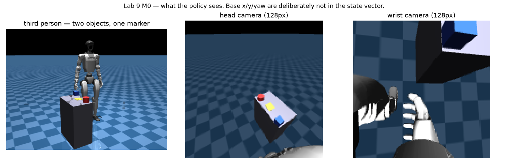
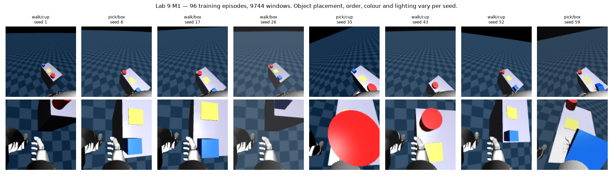
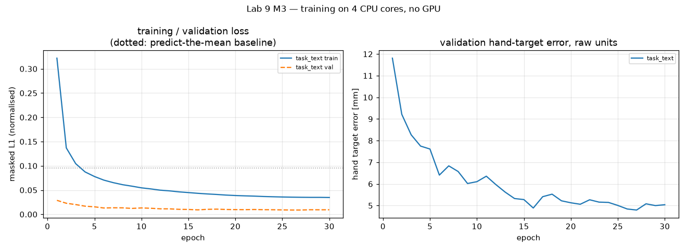
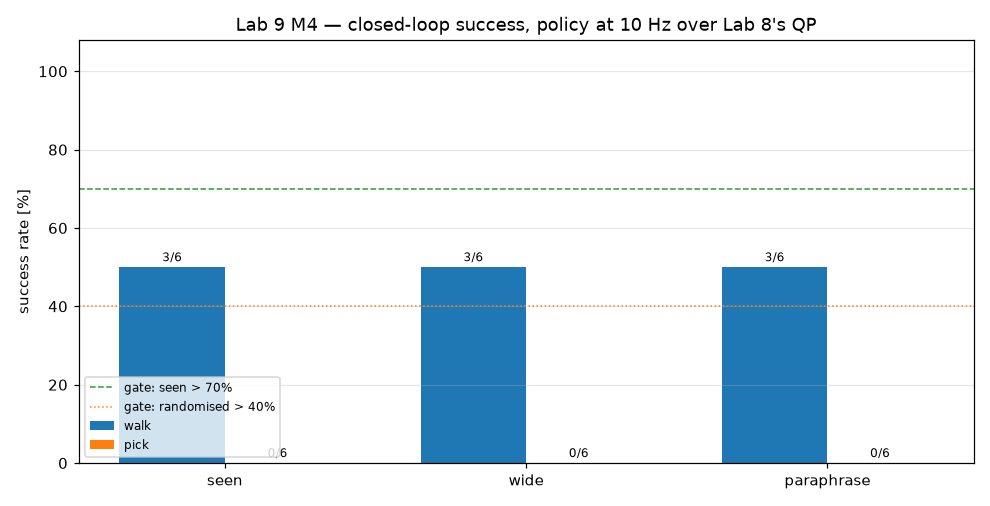

# Lab 9 — VLA Integration

> **Status:** ✅ Closed 2026-08-18 — **M0–M3 and M5's inference gate passed; M4 and M5's task gate failed, with the cause measured.**
> **Platform:** Unitree G1 under torque control (Lab 8) + ACT policy + frozen CLIP text tower
> **Goal:** one sentence in, autonomous loco-manipulation out — the destination
> the whole series was built toward.

Labs 1–8 built the manual pipeline: kinematics, dynamics, planning, grasping,
locomotion, whole-body control. Lab 9 replaces the hand-coded task logic with a
learned policy that takes camera images plus a language instruction and emits
actions. Understanding the manual stack is what makes the learned one debuggable
— and in this lab it is also what *runs underneath* it: the policy decides what
to do, and Lab 8's whole-body QP keeps the robot upright while it does it.

---

## Milestones

| # | Milestone | Gate | Status |
|---|---|---|---|
| M0 | Scene, cameras, obs/action contract | expert success ≥ 70 %, cameras render, codecs exact | ✅ **PASS** |
| M1 | Demonstration dataset | ≥ 50 demos/task, integrity, no seed leakage | ✅ **PASS** |
| M2 | Model | shapes, overfit-one-batch, language changes the action | ✅ **PASS** |
| M3 | Training | val error beats predict-the-mean | ✅ **PASS** |
| M4 | Closed-loop evaluation | > 70 % seen, > 40 % randomised, instruction changes behaviour | ❌ **FAIL** |
| M5 | Capstone + inference profiling | free-form language → episode, > 10 Hz | ⚠️ inference **PASS**, task **FAIL** |
| M6 | Documentation & blog | docs EN/TR + blog | ✅ **PASS** |

**The headline is a negative result with a measured cause.** The policy trains
cleanly — validation error 0.11× the predict-the-mean baseline, 4.1 mm
hand-target error — walks to the object and stops within **1 mm** of the right
place, runs inference at **37 Hz** on four CPU cores, and then **ignores its
instruction** and never completes a grasp. Both failures are traced to specific,
stated mechanisms below rather than reported as a score.

---

## Four deviations from the brief, and why

Each is forced by something measured. Full argument in
[`tasks/PLAN.md`](tasks/PLAN.md).

**1. The language head is not this lab's contribution.** `plan/LAB_09.md` says
to extend `ozkannceylan/humanoid_vla` by *adding* language conditioning. Reading
that repository first showed it already ships a frozen CLIP text tower, an
instruction bank baked into the checkpoint, and spatial vision tokens. What has
never existed is the brief's *other* bullet — the expert is Labs 3–8, so the
policy is trained on a **walking** humanoid, where balance is a live constraint
for every action it emits. That is the contribution.

**2. There is no GPU, and rendering is software.** Measured before planning
anything: no CUDA device, 4 cores; MuJoCo offscreen rendering at **97 ms/frame
and resolution-independent** (the cost is per-geometry setup in llvmpipe, not
fill — 64 px and 224 px cost the same, and 380 ms with shadows and reflections
on). So 128 px images, shadows off, and a training budget sized to four cores.
The brief's "INT8 on an RTX 4050" becomes CPU dynamic quantisation, reported as
that.

**3. The action space the brief specifies is the one Lab 7 predicts will fail.**
The brief asks for joint-position targets on all 29 DOF. On a floating base
that is precisely what Lab 7 measured cannot stabilise this robot. So the
primary head emits what Lab 8's QP consumes — hand targets, a gait command, a
grasp bit — and the brief's literal joint head is kept as the ablation that
tests the prediction.

**4. Two tasks, not the brief's three-to-five — because of the expert, not the
model.** See M0.

---

## M0 — Scene, Cameras, and the Observation/Action Contract ✅

A randomisable two-object loco-manipulation scene, egocentric cameras, a frozen
definition of what the policy sees and emits, and a programmatic expert built
from Lab 8's controller.

```bash
MUJOCO_GL=egl python3 lab-9-vla-integration/src/m0_scene_check.py --seeds 20
pytest lab-9-vla-integration/tests/      # 30 tests
```

### Gate results

| Criterion | Result | Measured |
|---|---|---|
| Expert success rate ≥ 70 % | PASS | **100 % (40/40)**, 20 seeds × 2 objects |
| Both cameras render at 128 px | PASS | head + wrist, non-degenerate |
| Action codec round-trips exactly | PASS | 5.9e-08 |
| State matches its declared dimension | PASS | 62 |
| Approach depends on the named object | PASS | 2 steps or 4, by target |
| Torques within limits on success | PASS | 92.6 N·m peak (limit 139) |

reach error **15.2 ± 7.3 mm** · lift height **90 ± 6 mm**



Video: [`media/m0_expert_rollout.mp4`](media/m0_expert_rollout.mp4)

### Two design decisions the rest of the lab rests on

**The state vector deliberately omits the pelvis's world x, y and yaw.** A
policy handed its own world coordinates can solve every task here by dead
reckoning — walk until x > 0.25, reach to a fixed offset — without ever looking
at an image or reading its instruction, and it would post an excellent success
rate having learned nothing about either. What remains (joint angles and
velocities, pelvis height, roll and pitch, grasp bit) is what a real IMU and
joint encoders observe. A test asserts that translating the robot in the world
leaves the state unchanged.

**The scene carries two objects, and the instruction chooses.** With one object
a four-task label set is inferable from the robot's own pose — walking and
reaching look nothing alike — so language would be free to ignore. With two, the
same image demands different actions under different instructions, which is the
only setup in which "the policy follows instructions" is falsifiable. The named
object even decides *how far to walk*: the near one is a two-step approach, the
far one four.

### The finding: an inherited expert is a hypothesis, not a given

The plan assumed Lab 8's capstone controller would demonstrate walk → pick →
carry → place. Lab 8's own gate is 4/4 on **one** configuration. Run over a
randomised two-object scene, the same sequence scored **1/8**.

That is not a bug in either lab — it is Lab 8's own M4 lesson applying to Lab 8:
*a result a no-op perturbation destroys is a draw from a distribution*, and
randomising object placement is such a perturbation. So each task was measured
separately and the set cut to what the expert can actually demonstrate:

| task | measured | why it fails |
|---|---|---|
| `walk` + `pick` | **40/40** | — |
| `carry` (walk holding the object) | 1/12 | `carry_targets` mirrors the grip about the payload, and at this grasp offset the two wrist targets come out 22–35 mm apart — both wrists are asked into nearly the same point |
| `place` (set it on a marker) | 5/10 | the hand tasks control position only, so the object is released at whatever tilt the wrist has (22° measured) 12 mm above the surface, lands on an edge and rolls 84 mm |

A demonstration set whose expert falls in half its episodes teaches a policy to
fall, and no model work recovers from that. Restoring `place` needs a
hand-**orientation** task, which is a change to Lab 8's controller and is
recorded as Lab 8 follow-up rather than smuggled in here.

### Three more measurements worth carrying

**A frozen balance reference has a shelf life, and it is about six seconds.**
Lab 8's `_freeze_balance` pins the DCM target at the value it had when the phase
began. Lab 9 has no carry-walk, so its whole manipulation happens in one
continuous stand — 11.5 s at Lab 8's timings, where Lab 8 never stood more than
~7 s before walking and replanning. The failure is unmistakable once traced: the
DCM error grows **exponentially at the LIPM rate**, doubling every ~0.15 s from
4.5 mm, while the hand still tracks to 5 mm and peak torque sits at 21 N·m.
Saturation only appears on the way down.

| continuous standing | episodes completed |
|---|---|
| 11.5 s (Lab 8's timings) | 0 / 4 |
| 6.9 s | 3 / 4 |
| **5.2 s** | **4 / 4** |

Splitting the motion into short re-anchored segments was tried and measured
*worse* — re-freezing repeatedly removes the feedback that was correcting the
drift. Lab 9's phase durations are sized to a 5.6 s budget and a test asserts it.

**Reach accuracy is the wrong quantity to tune a stopping distance on.** It is
flat at 7–11 mm for standoffs from −0.01 m to 0.37 m, so 0.22 m looked as good
as anything. At 0.22 m the arm is extended 0.43 m from the pelvis, and the
*lift* — not the reach — saturates the waist and puts the robot down. Lab 8's
own capstone stood 0.06 m from its payload, making the reach almost entirely
lateral with the arm folded.

**A borrowed constant hides the object it was measured on.** Lab 8's
`GRASP_OFFSET` is a fixed −0.060 m: its payload's 0.030 m half-extent plus a
0.030 m wrist clearance. Applied to a 0.040 m radius cup it puts the wrist
*inside* the object. Every one of M0's four failures at 90 % was a near cup,
reaching to 29–30 mm where the box reached to 7–11 mm from the identical
controller. Scaling the offset by the target's own half-extent: **36/40 →
40/40**.

---

## M1 — Demonstration Dataset ✅

```bash
MUJOCO_GL=egl python3 lab-9-vla-integration/src/collect_demos.py --seeds 60
MUJOCO_GL=egl python3 lab-9-vla-integration/src/dataset.py --grid
```

| Criterion | Result | Measured |
|---|---|---|
| ≥ 50 demonstrations per task | PASS | **120 per task** (240 total) |
| Every attempted episode succeeded | PASS | 120 / 120 |
| Integrity checks | PASS | no NaNs, shapes and dtypes as declared |
| Train/val split leaks no seed | PASS | 48 / 12, intersection empty |
| Randomisation visibly varies | PASS | contact sheet below |

12,180 frames · 244 MB · 38.4 min on 4 cores. One expert rollout per seed,
**sliced by phase** into its labelled task segments — rendering dominates
collection, so a rollout is expensive and a task label is free.



Two things stored deliberately. The action is the **expert's command**, not the
achieved state: behaviour cloning imitates what the expert did, and on a
compliant, disturbed system the two differ. And each frame keeps its **phase
label** alongside the derived task segment — which is what later made two
labelling bugs a `--reslice` pass instead of 40 minutes of re-simulation.

---

## M2 — Model ✅

```bash
python3 lab-9-vla-integration/src/m2_model_check.py
```

| Criterion | Result | Measured |
|---|---|---|
| Parameter count reported | PASS | 15.75 M total, 12.96 M trainable |
| Token count derived from image size | PASS | 16 tokens/camera at 128 px |
| Instruction changes the action | PASS | max delta 0.0020 |
| Same instruction is deterministic | PASS | 0.0 |
| Meanings separate further than paraphrases | PASS | margin **0.111** |
| Overfits one batch | PASS | 0.250 × the constant-predictor baseline |
| Checkpoint round-trips predictions | PASS | 0.0 |

The instruction bank puts paraphrases of one command at cosine 0.957 and
commands that mean different things at 0.846. Both properties are needed and
they pull opposite ways, so both are checked before training rather than
inferred from a bad success rate after.

**The overfit check failed first, and the model was not at fault.** It plateaued
at exactly the constant-predictor level — the signature of a network that cannot
distinguish its inputs. Sweeping the learning rate before reading the token
assembly: 0.19 at 1e-3, 0.17 at 3e-4, 0.15 at 1e-4, plateau at 3e-3. The check's
own optimiser was destabilising the transformer.

---

## M3 — Training ✅

```bash
python3 lab-9-vla-integration/src/train.py --epochs 24
python3 lab-9-vla-integration/src/m3_train_report.py
```

| Criterion | Result | Measured |
|---|---|---|
| Validation beats predict-the-mean | PASS | **0.11 ×** baseline |
| Hand-target error in raw units | PASS | **4.1 mm** |
| Both tasks learned separately | PASS | walk 0.002, pick 0.021 |
| Validation seeds never trained on | PASS | split by scene seed |
| Training curves recorded | PASS | below |

24 epochs, 110 minutes on 4 CPU cores, no GPU.



### Two labelling bugs a validation loss cannot see

The first training run scored *better* than this one and did nothing useful in
closed loop. Both causes were labels, and neither is visible in a loss curve.

**The gait bit was a pure function of the instruction.** Every frame of a `walk`
demonstration carried `gait = 1`, because the expert's stop was labelled `pick`.
So *when to stop* appeared nowhere in the training signal, the policy learned the
label perfectly, and it walked to the step cap on every episode — correctly. The
stop phase now belongs to `walk`.

**The pick policy predicted its own current hand position**, for 25 consecutive
polls, 188 mm from the object. The `pick` segment began at the expert's stop,
where the hand tasks are disabled and the recorded action is "leave the hand
where it is". Acting on that reproduces the observation that produced it — an
absorbing state. The segment now starts at the reach.

What is left is a genuine language problem: the same observation — stopped
robot, resting arm — demands *stand still* under "walk to the red cup" and
*start reaching* under "pick up the red cup".

---

## M4 — Closed-Loop Evaluation ❌

```bash
MUJOCO_GL=egl python3 lab-9-vla-integration/src/evaluate.py --episodes 3
```

| Criterion | Result | Measured |
|---|---|---|
| > 70 % on seen configurations | **FAIL** | 25 % (3/12) — walk 50 % (3/6), pick 0 % (0/6) |
| > 40 % on position-randomised | **FAIL** | 25 % (3/12) — walk 50 %, pick 0 % |
| Held-out paraphrases | — | 25 % (3/12), identical to seen |
| Instruction changes the behaviour | **FAIL** | commanded separation 0.159 m, produced **0.000 m** |
| No falls | partial | 2 falls in 18 pick episodes, 0 in 18 walk episodes |



Per-episode records: [`media/m4_episodes.csv`](media/m4_episodes.csv).

### The policy ignores its instruction, and the demonstrations are why

Walk sitting at exactly 50 % in all three conditions is the signature, not a
coincidence: the robot stops at the **near** object's distance whichever object
is named, and which one is near is randomised 50/50. It is scoring chance on a
binary choice.

Fed one stored observation with each of the two instructions:

| quantity | difference between "red cup" and "blue box" |
|---|---|
| right-hand target | **0.3 mm** |
| gait command | **0.0018** |

The two-object scene was built at M0 precisely to make language necessary, and
it does — *in principle*. What makes it unnecessary in practice is the **expert's
own competence**: it walks until the named object is the one in front of it, so
by the time the reach begins "reach for the nearest object" is correct in every
training frame. And during the walk, the instruction only discriminates for the
handful of frames around the stop.

The shortcut is available and cheap, and behaviour cloning takes it. A scene in
which two instructions demand different actions is a necessary condition, not a
sufficient one: the **demonstrations** must contain states where the correct
action differs under the two instructions *and the state does not reveal which
one is in force*. Fixing it is a re-collection, not a retrain.

### The reach converges, then stops converging

```
poll  0:  hand 188 mm from the cup
poll 24:  hand 102 mm
poll 36:  hand  84 mm
poll 48:  hand  84 mm
poll 69:  hand  83 mm      grasp gate 70 mm; the expert reaches 15.2 ± 7.3 mm
```

Not inert — it tracks the reach for 3.5 s, closing 100 mm, then plateaus 12 mm
short of the gate and holds for the remaining 35 polls. Each command moves the
hand about two thirds as far as the expert's did; under-commit every step and
the trajectory drifts somewhere the expert never was. A hand hovering 83 mm from
the object appears in no demonstration, and off the manifold the commanded
target collapses onto the current hand position. The same absorbing state,
reached from a different direction.

### What did work: stopping

When the named object is the near one, the policy stops **0.001 m** from the
correct standoff — a distance it has to infer from a 128 px image. Getting there
took two protocol corrections.

The policy is polled **mid-stride**, not between walk units: the expert never
pauses during an approach, so a robot standing with the objects still far away
is off-distribution.

And the stop decision reads the **whole predicted chunk**, not its first action.
Two frames before the expert stops, the true chunk is `[0, 0, …]` and the
prediction is `[0.99, 0.99, 0.99, 0.00, 0.00, …]` — the stop is in there, placed
about nine steps late. The head of a chunk is where a rare transition is rarest,
so that is exactly where the model hedges it. Reading the chunk mean instead took
stopping error from 0.21 m to 0.001 m without touching a weight.

---

## M5 — Capstone and Inference Profiling ⚠️

```bash
MUJOCO_GL=egl python3 lab-9-vla-integration/src/capstone_demo.py \
    --instruction "pick up the red cup"
```

| Criterion | Result | Measured |
|---|---|---|
| Free-form sentence in, no task index anywhere | PASS | instruction embedded by the frozen tower; nothing else selects behaviour |
| Inference > 10 Hz | **PASS** | **37.0 Hz** float32 (27.1 ms) · **38.4 Hz** dynamically quantised (26.0 ms) |
| Episode succeeds on simulated state | **FAIL** | walked to 0.253 m and stopped; never grasped |
| No fall | PASS | 51 N·m peak of a 139 N·m limit |

Video: [`media/m5_capstone.mp4`](media/m5_capstone.mp4)

Dynamic quantisation buys 4 % rather than the large factor INT8 gives on a GPU —
the backbone is convolutional and stays float, so only the decoder's linear
layers quantise. The brief's ">10 Hz with INT8 on an RTX 4050" is met on four CPU
cores without it. The control loop is limited by software **rendering** at 97 ms
a frame, not by the network, and those two costs are reported separately for that
reason.

### Not run: the joint-head ablation

`tasks/PLAN.md` promised to train the brief's literal 29-DOF joint action space
and measure it against Lab 7's prediction that a joint-position reference cannot
stabilise this robot. The code path exists (`policy_runner.joint_tick`, with
Lab 8's standing gains and gravity compensation so the comparison is about the
action space rather than a strawman controller) and the head trains from the same
dataset, but the run was not made. Recorded as unmeasured rather than quietly
dropped.

---

## What I would change first

1. **Re-collect so the instruction is load-bearing in the *data*.** Position the
   expert so both objects are equally reachable at the reach, and have it walk to
   a target-independent stopping point. Then "reach for the nearest object"
   stops being a valid policy and the instruction is the only discriminator.
2. **Close the reach.** The plateau is compounding error; DAgger-style
   correction, or demonstrations that include recoveries from off-nominal hand
   positions, is the standard remedy.
3. **Then** the joint-head ablation, which is cheap once the primary works.

---

## Architecture

```
      "pick up the red cup"
              │
     ┌────────▼─────────┐   frozen; embeddings baked into the checkpoint,
     │ CLIP text tower  │   so evaluation needs neither transformers nor
     └────────┬─────────┘   the network
              │ 512
head cam ─┐   │
wrist cam ┤   │        ┌──────────────────────────────┐
 (128²)   ├───┴───────►│  ACT policy                  │
proprio ──┘            │  ResNet18 (layer4 trainable) │
 (62-d)                │  + spatial tokens + state    │
                       │  + instruction token         │
                       │  → chunk of 20 actions       │
                       └───────────────┬──────────────┘
                                       │ 10 Hz
                       ┌───────────────▼──────────────┐
                       │  Lab 8 whole-body ID QP      │   1 kHz
                       │  balance is a hard constraint│
                       └───────────────┬──────────────┘
                                       │ τ (29)
                                  MuJoCo G1
```

The policy decides *what*; Lab 8's QP decides *how to stay upright*. Balance is
never a learned quantity.

Design record: [`tasks/ARCHITECTURE.md`](tasks/ARCHITECTURE.md) ·
Milestone plan: [`tasks/PLAN.md`](tasks/PLAN.md) ·
Every finding in long form: [`tasks/LESSONS.md`](tasks/LESSONS.md)

### Modules

| File | Role |
|---|---|
| `src/lab9_common.py` | Paths, obs/action constants, instruction vocabulary, Lab 8 re-exports |
| `src/vla_scene.py` | Two-object randomisable scene, egocentric cameras, four welds |
| `src/observations.py` | The observation and action contract — the only place the layout is defined |
| `src/expert.py` | Lab 8's capstone subclassed: seedable, target-selectable, observation-capturing |
| `src/m0_scene_check.py` | M0 gate |
| `src/collect_demos.py` | Multi-process demonstration generation, phase-sliced |
| `src/dataset.py` | Chunked dataset with pad masks and a seed-level split |
| `src/text_encoder.py` | Frozen CLIP text tower + instruction bank |
| `src/act_policy.py` | The ACT model: two cameras, derived token count, two action heads |
| `src/m2_model_check.py` | M2 gate |
| `src/train.py` | Training loop, masked L1, baseline-relative validation |
| `src/policy_runner.py` | Closed-loop execution: policy at 10 Hz over Lab 8's QP |
| `src/evaluate.py` | M4: per-task success, randomised, instruction swap, joint-head ablation |
| `src/capstone_demo.py` | M5: free-form language in, recorded episode out |
| `tests/` | Scene, contract, randomisation, instructions, model, checkpoint |

---

## Setup

```bash
./tools/setup_env.sh                     # deps + Menagerie clone
pip install osqp                         # Lab 8's QP solver
pip install torch torchvision --index-url https://download.pytorch.org/whl/cpu
pip install transformers                 # training only; evaluation uses the bank
export MUJOCO_GL=egl
```

---

## Credits

The ACT architecture is Zhao et al., *Learning Fine-Grained Bimanual
Manipulation with Low-Cost Hardware* (RSS 2023). The implementation here is
adapted from [`ozkannceylan/humanoid_vla`](https://github.com/ozkannceylan/humanoid_vla),
which supplied the design of the frozen text tower, the instruction bank and the
in-checkpoint normalisation; the deltas (two cameras, derived token count, this
lab's action heads) are listed in `tasks/ARCHITECTURE.md`.
